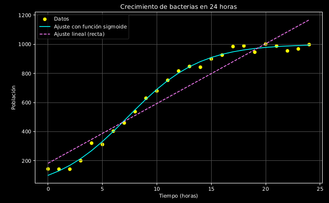
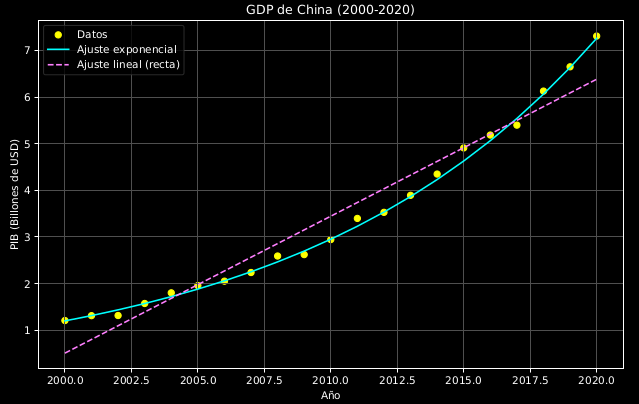
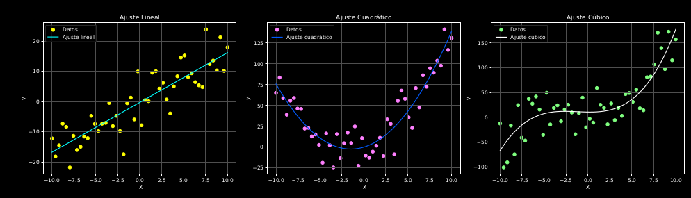
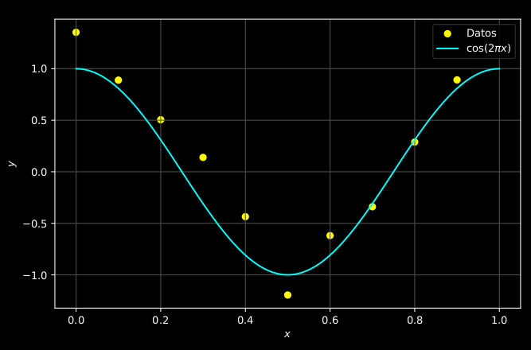
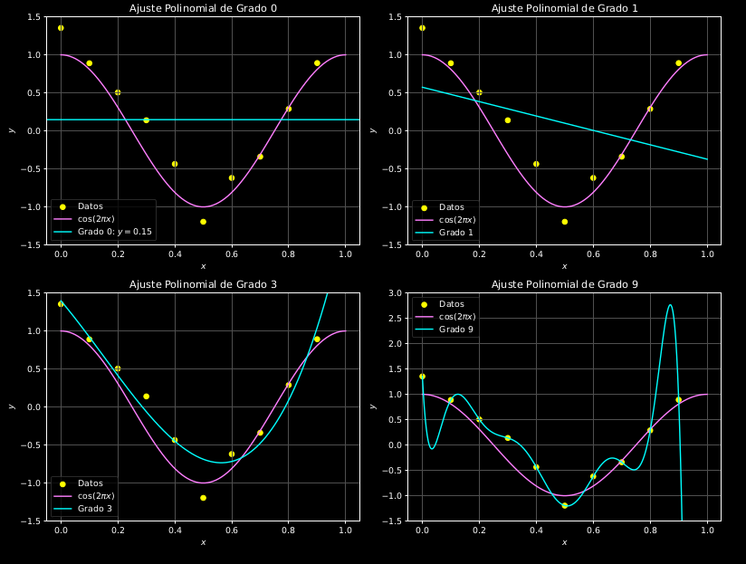
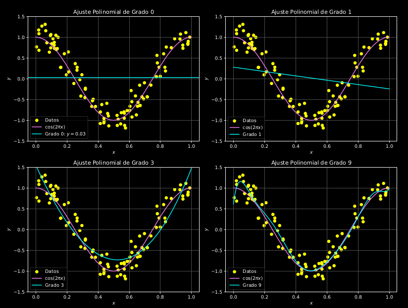
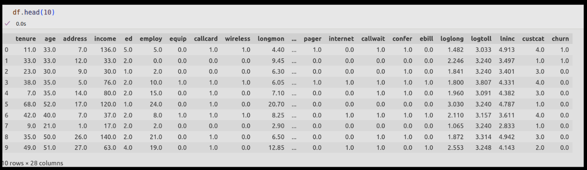
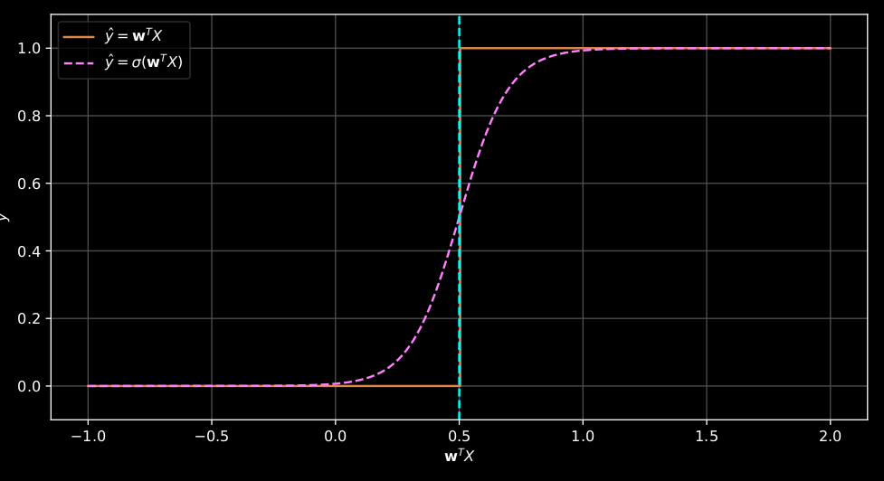
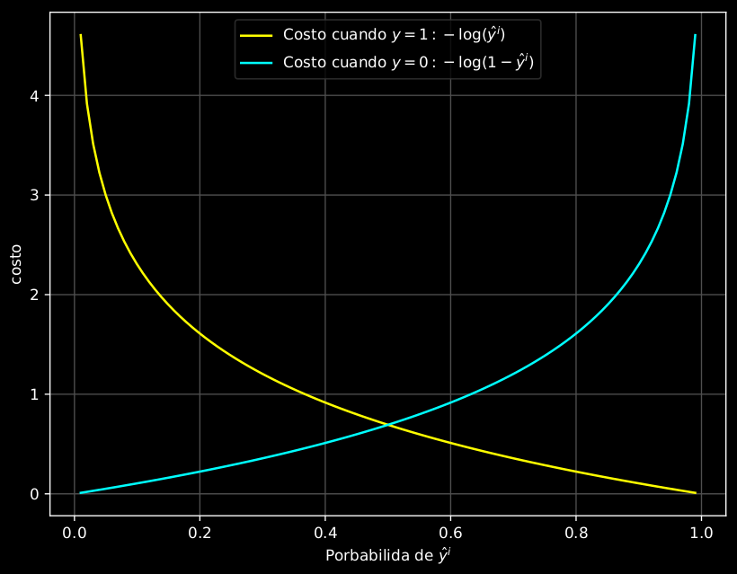

# Principios de Deep Learning

El Deep Learning es la rama más exitosa del ML en la actualidad. Dedicaremos este primer módulo a explorar los principios en los que se basa esta interesante aproximación al aprendizaje automático desde un punto de vista formal, tratando de motivar de manera intuitiva sus principios.

## Cómo llegamos hasta aquí

Desde los inicios de la invención de los primeros computadores basados en electricidad, la pretensión consistía en emular en procesos computacionales el pensamiento humano. Es muy posible que los matemáticos de los años 40 pensaran que era posible crear representaciones matemáticas de los procesos mentales. Es de particular importancia, por ejemplo, la formulación del álgebra booleana propuesta por George Boole en el año 1854 en su obra *"An Investigation of the Laws of Thought: On Which are Founded the Mathematical Theories of Logic and Probabilities"*.

Hoy en día, es claro que una *Investigación de las Leyes del Pensamiento: Sobre las Cuales se Fundan las Teorías Matemáticas de la Lógica y las Probabilidades* está fuera del alcance de cualquier investigación seria en matemáticas. Sin embargo, Boole logró establecer la primera teoría formal sobre las proposiciones lógicas que los seres humanos usamos en el día a día. Por ejemplo, consideremos las siguientes expresiones lógicas y su implementación utilizando teoremas del álgebra booleana:

=== "Código"
```python
# Ejemplo de expresiones lógicas y álgebra booleana

# Definimos dos variables booleanas basadas en expresiones cotidianas
# A representa "Hoy es lunes"
# B representa "Está lloviendo"

A = False  # Supongamos que hoy no es lunes
B = True   # Supongamos que está lloviendo

# Aplicamos operaciones booleanas
AND_result = A and B  # Operación AND
OR_result = A or B    # Operación OR
NOT_result = not A    # Operación NOT

# Mostramos los resultados
print("A AND B (Hoy es lunes Y Está lloviendo):", AND_result)
print("A OR B (Hoy es lunes O Está lloviendo):", OR_result)
print("NOT A (No es lunes):", NOT_result)
```

=== "Salida"
```bash
A AND B (Hoy es lunes Y Está lloviendo): False
A OR B (Hoy es lunes O Está lloviendo): True
NOT A (No es lunes): True
```

Una observación interesante es que las operaciones aritméticas pueden ser modeladas por esta misma lógica booleana.


Considera, por ejemplo, la suma de los dos números representados en la figura utilizando un ábaco en base 2 (binario). La suma consiste en superponer las dos representaciones siguiendo las siguientes reglas: si dos fichas se superponen en una columna, estas se reemplazan por una ficha en la columna siguiente. Este comportamiento es similar al "acarreo" (reciduo, o simplemente "lo que sobra") en la suma binaria tradicional.

Para explicar mejor, supongamos que estamos sumando dos números binarios. Si en una posición tenemos dos '1', se genera un acarreo ('1') a la posición siguiente, y la posición actual se queda con un '0'. Este comportamiento se describe por la tabla en la figura, donde se puede ver que el comportamiento del "residuo" sigue el álgebra del operador AND, mientras que el acarreo sigue el operador OR.

La tabla de verdad para la suma binaria es la siguiente:

| A | B | Suma (A XOR B) | Acarreo (A AND B) |
|---|---|----------------|-------------------|
| 0 | 0 | 0              | 0                 |
| 0 | 1 | 1              | 0                 |
| 1 | 0 | 1              | 0                 |
| 1 | 1 | 0              | 1                 |

En esta tabla, `Suma` representa el resultado de la posición actual sin considerar el acarreo, y `Acarreo` representa el valor que se lleva a la siguiente posición.

En 1937, Claude Shannon, en su tesis de maestría, [*"A Symbolic Analysis of Relay and Switching Circuits"*](https://dspace.mit.edu/handle/1721.1/11173), demostró cómo las operaciones lógicas del álgebra booleana podían ser representadas y manipuladas mediante interruptores eléctricos, sentando así las bases para el diseño de circuitos digitales modernos y las computadoras tal como las conocemos hoy.


Así, por ejemplo, la lógica del operador AND puede ser simulada por la luz o ausencia de luz en el LED del circuito de la figura.


Mientras que la compuerta NOT puede ser simulada por el circuito:


La computación se reduce entonces a conducir electricidad a través de estos circuitos que codifican la lógica de Boole para generar operaciones aritméticas. Por ejemplo, el arreglo de la figura suma dos bits:


[Ver el video relacionado](https://www.youtube.com/watch?v=QZwneRb-zqA&t=504s)

## Ajustes no lineales

En muchos problemas del mundo real, las relaciones entre las variables no siguen un patrón estrictamente lineal. Por ejemplo, en la figura se presentan dos conjuntos de datos ficticios: el crecimiento de una población de bacterias y el aumento del PIB de China a lo largo de los años. Observa que un ajuste lineal no captura adecuadamente los patrones presentes en ninguno de estos casos.



*Datos ficticios que ilustran el crecimiento de la población de bacterias y el crecimiento del PIB de China a lo largo de los años. Los patrones observados sugieren que un ajuste lineal no es apropiado para estos conjuntos de datos*

El crecimiento de las bacterias, como ocurre frecuentemente en poblaciones biológicas, es mejor modelado por una función sigmoide (en forma de 'S') que refleja un crecimiento inicial lento, seguido por una aceleración, y finalmente un estancamiento debido a limitaciones de recursos, como se describe en la función:

\[
P(t) = \frac{K}{1 + \left(\frac{K - P_0}{P_0}\right) e^{-rt}}
\]

donde \(P(t)\) representa la población en el tiempo \(t\), \(P_0\) es la población inicial, \(K\) es la capacidad de carga máxima del entorno, y \(r\) es la tasa de crecimiento. Esta función captura de manera efectiva el comportamiento de sistemas biológicos en ambientes con recursos limitados.

Por otro lado, el crecimiento del PIB de China podría ajustarse más precisamente a una función exponencial, que describe el rápido aumento característico de economías en desarrollo. Esta relación se modela con:

\[
\text{PIB}(t) = GDP_0 \cdot e^{r(t - t_0)}
\]

donde \(GDP_0\) es el PIB inicial, \(r\) es la tasa de crecimiento promedio, \(t\) es el tiempo, y \(t_0\) es el año de referencia.

## Regresiones polinómicas

Para representar patrones más complejos en los datos, podemos usar regresiones polinómicas, como se muestra en la figura. Estas ajustan curvas en lugar de rectas, permitiendo modelar relaciones no lineales.


*Ajustes Polinómicos: De izquierda a derecha: ajuste lineal, ajuste cuadrático y ajuste cúbico.*

Por ejemplo, un polinomio de grado 3 se describe como:

\[
\widehat{y} = b + w_1 x + w_2 x^2 + w_3 x^3
\]

donde los \(w_i\) son los pesos o parámetros del modelo. Sin embargo, las regresiones polinómicas pueden considerarse un caso especial de regresión lineal si redefinimos las variables como:

\[
x_1 = x, \quad x_2 = x^2, \quad x_3 = x^3
\]

lo que transforma la ecuación en:

\[
\begin{align*}
\widehat{y} & = b + w_1 x_1 + w_2 x_2 + w_3 x_3 \\
& = b + \mathbf{w}^{\top} \mathbf{x},
\end{align*}
\]

siendo una ecuación lineal en los pesos \(w\). Esto permite aplicar técnicas como la minimización del error cuadrático medio (MSE), siempre que la relación entre \(\hat{y}\) y los pesos sea lineal. En esencia, los ajustes polinomiales son un caso particular de las regresiones lineales.

### Modelos genuinamente no lineales

Un modelo se considera no lineal cuando la relación entre \(\hat{y}\) y los pesos \(w\) no es lineal. Por ejemplo, los modelos

\[
\hat{y} = w_0 + w^2 x, \quad \hat{y} = w_0 e^{w_1 x},
\]

describen relaciones no lineales entre la variable dependiente y los pesos. En estos casos, no podemos usar técnicas como la minimización del error cuadrático medio y la estimación de los parámetros no es tan fácil.

## El problema del sobreajuste (Overfitting)

Cuando usamos modelos más complejos, como las regresiones polinómicas de alto grado, surge el riesgo de sobreajuste. Esto ocurre cuando el modelo no solo captura el patrón subyacente de los datos, sino también el ruido, lo que reduce su capacidad de generalización.

Para ilustrarlo, consideremos un ejemplo en el que deseamos predecir una variable \(y\) a partir de una variable de entrada \(x\). Los datos se generan a partir de la función \(\cos (2 \pi x)\) con ruido gaussiano añadido. La Figura  muestra los datos de entrenamiento (\(m\) observaciones, denotadas como \(x = (x_1, x_2, \ldots, x_N)^{\top}\) y \(y = (y_1, y_2, \ldots, y_m)^{\top}\)) junto con la función \(\cos (2 \pi x)\) a partir de la cual fueron generados.

*Datos de entrenamiento, generados a partir de la función \(\cos (2 \pi x)\) con ruido gaussiano añadido, se muestran junto con la función original.*


En la Figura abajo , se presentan cuatro subgráficos, cada uno con un ajuste de diferentes grados polinómicos: grado 0, grado 1, grado 3 y grado 9.

*Ajuste de diferentes grados polinómicos: grado 0, grado 1, grado 3 y grado 9. No necesariamente el ajuste de mayor grado es el que mejor generaliza las regiones en las que no hay datos disponibles.*

A medida que aumentamos el grado del polinomio, observamos que:

- En el ajuste de grado 0, el modelo es un valor constante, que no capta adecuadamente la estructura de los datos. Este ajuste es demasiado simple y no refleja el patrón subyacente.
- En el ajuste de grado 1, el modelo captura una relación lineal entre las variables, lo que ya representa una mejora respecto al ajuste de grado 0. Sin embargo, este modelo aún es insuficiente para capturar la variabilidad de los datos, especialmente el comportamiento oscilante de la función coseno.
- El ajuste de grado 3 comienza a capturar más detalles de la variabilidad de los datos. Este modelo tiene suficiente flexibilidad para aproximarse a la forma general de la función \(\cos (2 \pi x)\), pero sin sobreajustar el ruido de los datos.
- En el ajuste de grado 9, el modelo se vuelve excesivamente flexible. Aunque sigue de cerca los datos de entrenamiento, empieza a ajustarse a las fluctuaciones del ruido en lugar de capturar solo el patrón subyacente. Este sobreajuste se refleja en un modelo que es muy específico a los datos de entrenamiento, pero que tendrá un rendimiento pobre cuando se le apliquen datos nuevos.

Finalmente, en la Figura abajo, se muestran los mismos ajustes, pero esta vez con \(m = 100\) datos.


Al aumentar el número de datos de entrenamiento, el riesgo de sobreajuste se reduce. Con más datos, el modelo tiene más ejemplos para aprender y, por lo tanto, es más probable que capture el patrón real subyacente, en lugar de las fluctuaciones aleatorias causadas por el ruido. En general, disponer de un conjunto de datos más grande mejora la capacidad de generalización del modelo, ya que ayuda a "suavizar" las variaciones aleatorias que podrían inducir al sobreajuste. Esto permite que el modelo generalice mejor y se enfoque en los patrones reales, en lugar de adaptarse al ruido específico del conjunto de entrenamiento.

### Regularización

Una alternativa para corregir el sobreajuste consiste en agregar un término adicional a la función de costo \(J(w)\) para penalizar los modelos que se ajustan demasiado bien a los datos de entrenamiento. Una función de costo regularizada para un modelo lineal puede ser escrita como:

\[
J(w) = \frac{1}{2m} \sum_{i=1}^m (\hat{y}^{(i)} - y^{(i)})^2 + \frac{\lambda}{2} \|\mathbf{w}\|^2,
\]

donde \(\lambda\) es el parámetro de regularización, y \(\|w\|^2\) es la norma cuadrada de los pesos $ \mathbf{w}^{\top} \mathbf{w} = w_0^2 +w_1^2 + \cdots + w_m^2 $

La primera parte de la función de costo, \(\frac{1}{2m} \sum_{i=1}^m (\hat{y}^{(i)} - y^{(i)})^2\), es la función de costo estándar de los mínimos cuadrados, que mide el error entre las predicciones del modelo y las observaciones reales. Sin embargo, este término por sí solo puede llevar al sobreajuste cuando el modelo tiene demasiada capacidad (por ejemplo, cuando tiene demasiados parámetros o es muy flexible).

La segunda parte, \(\frac{\lambda}{2} \|\mathbf{w}\|^2\), es el término de regularización. Este término penaliza los valores grandes de los pesos del modelo, pues \(\lambda\) grande o  \(\|\mathbf{w}\|\) grande significa un error grande evitando que el modelo se ajuste de forma excesiva a los datos de entrenamiento. El parámetro \(\lambda\) controla la cantidad de regularización aplicada al modelo. Cuando \(\lambda\) es pequeño, la regularización tiene un impacto menor, y el modelo puede sobreajustarse. Por el contrario, cuando \(\lambda\) es grande, el modelo se vuelve más rígido y menos susceptible al sobreajuste, pero podría perder flexibilidad y no ajustarse bien a los patrones complejos de los datos.

En otras palabras, el término \(\lambda \|w\|^2\) actúa como un "freno" sobre los pesos del modelo al minimizar la función de costo regularizada.

## Regresión Logística

La regresión logística es un algoritmo de clasificación para variables categóricas. A diferencia de la regresión lineal, que se utiliza para predecir resultados continuos (por ejemplo, precios de bienes raíces, presión arterial de pacientes o eficiencia de combustible de vehículos), la regresión logística se enfoca en resultados binarios como 'Sí/No', 'VERDADERO/FALSO', 'éxito/fracaso' o 'embarazada/no embarazada', los cuales se codifican típicamente como 0 o 1. La regresión logística es un excelente modelo para los casos en los que deseamos clasificar datos categóricos binarios y predecir no solo la clase a la que pertenece un caso, sino también la probabilidad asociada a esa clasificación.

El objetivo de la regresión logística es construir un modelo que pueda predecir la categoría de cada instancia, así como la probabilidad de que dicha instancia pertenezca a una categoría específica. Para comenzar, definamos estructuralmente el problema. Consideremos \(X\) como nuestro conjunto de datos, que consiste en \(m\) características o dimensiones y \(n\) registros, donde \(X \in \mathbb{R}^{m \times n}\).

La variable \(y\) indica la clase que deseamos predecir, pudiendo ser 0 o 1. Idealmente, un modelo de regresión logística, \(\hat{y}\), podría predecir que la clase de una instancia es 1 basándose en sus características \(x\), es decir,

\[
P(y = 1 \mid x) = 1.
\]

Por tanto, la probabilidad de que la instancia pertenezca a la clase 0 es simplemente el complemento de que pertenezca a la clase 1. Es decir,

\[
P(y = 0 \mid x) = 1 - P(y = 1 \mid x).
\]

Para ilustrar el algoritmo, consideremos el siguiente ejemplo:

*Captura de pantalla del dataframe de churn. El churn, o tasa de deserción, es un concepto común en análisis de datos, especialmente en sectores como telecomunicaciones, suscripciones y servicios en línea.*


El conjunto de datos llamado `churn dataset` que puedes descargar de Kaggle:

=== "Código"
    ```bash
    kaggle datasets download -d blastchar/telco-customer-churn
    ```

Es un conjunto de datos ficticio sobre los clientes de una compañía de telecomunicaciones. En este conjunto de datos, esta hipotética compañía de telecomunicaciones tiene información sobre:

- Clientes que han dejado el servicio en el último mes, una variable designada como "Churn", que indica si un cliente va a permanecer con los servicios de la compañía (0) o si la dejó (1).
- La gama de servicios a los que cada cliente está suscrito, incluyendo servicios telefónicos, opciones de múltiples líneas, acceso a internet, seguridad en línea, copia de seguridad en línea, protección de dispositivos, soporte técnico, así como servicios de streaming para televisión y películas.
- Detalles de la cuenta de cada cliente, que incluyen la duración del servicio, tipo de contrato, métodos de pago, si utilizan facturación sin papel, y los cargos mensuales y totales.
- Información demográfica sobre los clientes, como género, rango de edad, y si tienen parejas y dependientes.

Nuestro objetivo es calcular la probabilidad de que un cliente permanezca con los servicios de la compañía, por lo tanto, 'churn' será nuestra variable dependiente \(y\). Seleccionamos nuestras variables independientes \(X\) como

```python
cdf = df[['tenure', 'age', 'address', 'income', 'ed', 'employ', 'equip', 'callcard', 'wireless', 'churn']]
churn_df['churn'] = churn_df['churn'].astype('int')
churn_df.head()
```

Y obtenemos el dataframe:

*Captura de pantalla del dataframe de churn. Detalle de variables predictivas y variable dependiente.*

Queremos construir un modelo \(\hat{y}\) que nos indique la probabilidad de obtener \(y = 1\) dadas las características \(X\), es decir, \(\hat{y} = P(y = 1 \mid x)\)

\[
\widehat{y} = P(y = 1 \mid x)
\]

Para tener una mejor idea de por qué usar la regresión logística, supongamos que queremos predecir \(\hat{y}\) a través de una regresión lineal basada en la edad de los clientes. Podemos representar nuestros datos con un gráfico de dispersión:

*Gráfico de dispersión que ilustra la relación entre la edad de los clientes y la variable dependiente \(\hat{y}\) utilizando un modelo de regresión lineal. La línea recta representa el modelo de regresión lineal dado por \(\hat{y} = \mathbf{w}^{\top} X = w_0 + w_1 x\). En este ejemplo, el valor predicho para un nuevo cliente de 15 años es \(\hat{y} = 0.45\), lo cual no proporciona una indicación clara de si el cliente continuará con los servicios.*

En este caso, nuestra línea recta está dada por el modelo:

\[
\hat{y} = \mathbf{w}^{\top} X = w_0 + w_1 x
\]

Supongamos que el valor predicho para un nuevo cliente de 15 años es \(\hat{y} = 0.45\), como en la Figura \ref{fig:lineal_churn}. En este caso, 0.45 no nos indica con certeza si nuestro cliente continuará o no con los servicios. Entonces, inventamos una regla que nos permita decidir a qué clase pertenece el cliente. Por ejemplo:

\[
\widehat{y} = \begin{cases} 
0 & \text{si } \mathbf{w}^{\top} X < 0.5 \\
1 & \text{si } \mathbf{w}^{\top} X \geqslant 0.5 
\end{cases}
\]

Si el valor de \(\mathbf{w}^{\top} X\) es menor que 0.5, la clase es 0; de lo contrario, es 1. Dado que el valor del cliente es menor que 0.5, podemos afirmar que pertenece a la clase 0. La función descrita anteriormente actúa como un umbral y, si se grafica, se asemeja a la línea azul en la Figura \ref{fig:stepfunction}.


*Representación gráfica de la función sigmoide \(\sigma(x) = \frac{1}{1 + e^{-x}}\). Esta curva muestra cómo la función transforma el input lineal \(\mathbf{w}^{\top} X\) en una probabilidad entre 0 y 1, ideal para la clasificación binaria en regresión logística.*

La línea verde representa la aplicación de una función especial conocida como la función **sigmoide**, por su forma de 'S', denotada como \(\sigma(x)\) y definida por:

\[
\sigma(x) = \frac{1}{1 + e^{-x}}.
\]

Una propiedad importante de la función sigmoide se observa al sumar \(\sigma(x)\) y \(\sigma(-x)\):

\[
\begin{align*}
\sigma(x) + \sigma(-x) & = \frac{1}{1 + e^{-x}} + \frac{1}{1 + e^x} \\
& = \frac{1}{1 + e^{-x}} \cdot \frac{e^x}{e^x} + \frac{1}{1 + e^x} \\
& = \frac{e^x}{e^x + 1} + \frac{1}{1 + e^x} \\
& = \frac{e^x + 1}{e^x + 1} \\
& = 1
\end{align*}
\]

Así, la función sigmoide \(\sigma(x)\) se comporta como una función de probabilidad normalizada a 1, tal que \(\sigma(x) = 1 - \sigma(-x)\), lo que nos permite interpretar \(\sigma(\mathbf{w}^{\top} X)\) como la probabilidad \(P(y = 1 \mid x)\) de que una instancia pertenezca a la clase 1, dadas las características \(X\). Esto se expresa como:

\[
\sigma(\mathbf{w}^{\top} X) = P(y = 1 \mid x),
\]

mientras que

\[
1 - \sigma(\mathbf{w}^{\top} X) = P(y = 0 \mid x).
\]

Donde \(\mathbf{w}^{\top}\) debe ser encontrado en el proceso de entrenamiento del modelo de regresión donde

\[
\widehat{y} = \sigma(\mathbf{w}^{\top} X).
\]

Este es el llamado modelo de regresión logística y deriva su nombre del hecho de ajustar los datos con una regresión lineal y luego comprimir la función de ajuste a una probabilidad usando una función sigmoide (o logística). El proceso de entrenamiento es el mismo algoritmo que estudiamos para la regresión lineal:

1. Inicializa en un valor cualquiera \(\mathbf{w}\).
2. Calcula \(\hat{y} = \sigma(\mathbf{w}^{\top} X)\).
3. Compara la salida \(\hat{y}\) con el valor real etiquetado \(y\).
4. Calcula el error para todos los valores etiquetados \(y\) y suma los errores. El error total es la función de costo de tu modelo y es calculada por la función de costo.
5. Actualiza \(w\) para minimizar el costo \(J(\mathbf{w})\) y vuelve al paso 2.

## Función de costo

El proceso para minimizar el costo en modelos de regresión logística comúnmente emplea el método del gradiente descendente. La función de costo utilizada se conoce como la función de entropía cruzada y se escribe como:

\[
J(w) = -\frac{1}{m} \sum_{i=1}^m [y^i \log (\hat{y}^i) + (1 - y^i) \log (1 - \hat{y}^i)]
\]

Esta función de costo es adecuada porque penaliza significativamente las predicciones incorrectas. Como lo muestra la Figura \ref{fig:crossEntropyCost}, la expresión \(- y^i \log (\hat{y}^i)\) es clave; el logaritmo negativo \(- \log (t)\) se incrementa considerablemente cuando \(t\) se aproxima a 0, lo que implica un costo alto si el modelo estima una probabilidad cercana a 0 para una instancia positiva. Por otro lado, \((1 - y^i) \log (1 - \hat{y}^i)\) actúa para las instancias negativas; \(- \log (t)\) es cercano a 0 cuando \(t\) es cercano a 1, resultando en un costo casi nulo si la probabilidad estimada es cercana a 0 para una instancia negativa o cercana a 1 para una positiva, que es exactamente lo que deseamos.

*Visualización de la función de costo de \textit{cross-entropy} en modelos de regresión logística. La gráfica ilustra cómo la expresión \(- y^i \log (\hat{y}^i)\) contribuye al aumento del costo cuando la probabilidad estimada para una instancia positiva se acerca a 0, y cómo \((1 - y^i) \log (1 - \hat{y}^i)\) actúa en las instancias negativas.*

La eficacia de esta función radica en que a mayor discrepancia entre la predicción \(\hat{y}^i\) y el valor real \(y^i\), mayor es el logaritmo del error, incrementando así el costo. Esto incentiva al modelo a ajustar los parámetros \(w\) de manera que se minimice el error en las predicciones.