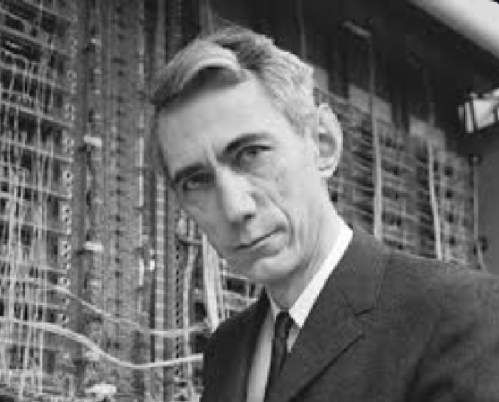

# Principios de Deep Learning

El Deep Learning es la rama más exitosa del ML en la actualidad. Dedicaremos este primer módulo a explorar los principios en los que se basa esta interesante aproximación al aprendizaje automático desde un punto de vista formal, tratando de motivar de manera intuitiva sus principios.

## Cómo llegamos hasta aquí

Desde los inicios de la invención de los primeros computadores basados en electricidad, la pretensión consistía en emular en procesos computacionales el pensamiento humano. Es muy posible que los matemáticos de los años 40 pensaran que era posible crear representaciones matemáticas de los procesos mentales. Es de particular importancia, por ejemplo, la formulación del álgebra booleana propuesta por George Boole en el año 1854 en su obra *"An Investigation of the Laws of Thought: On Which are Founded the Mathematical Theories of Logic and Probabilities"*.

Hoy en día, es claro que una *Investigación de las Leyes del Pensamiento: Sobre las Cuales se Fundan las Teorías Matemáticas de la Lógica y las Probabilidades* está fuera del alcance de cualquier investigación seria en matemáticas. Sin embargo, Boole logró establecer la primera teoría formal sobre las proposiciones lógicas que los seres humanos usamos en el día a día. Por ejemplo, consideremos las siguientes expresiones lógicas y su implementación utilizando teoremas del álgebra booleana:

=== "Código"
```python
# Ejemplo de expresiones lógicas y álgebra booleana

# Definimos dos variables booleanas basadas en expresiones cotidianas
# A representa "Hoy es lunes"
# B representa "Está lloviendo"

A = False  # Supongamos que hoy no es lunes
B = True   # Supongamos que está lloviendo

# Aplicamos operaciones booleanas
AND_result = A and B  # Operación AND
OR_result = A or B    # Operación OR
NOT_result = not A    # Operación NOT

# Mostramos los resultados
print("A AND B (Hoy es lunes Y Está lloviendo):", AND_result)
print("A OR B (Hoy es lunes O Está lloviendo):", OR_result)
print("NOT A (No es lunes):", NOT_result)
```

=== "Salida"
```bash
A AND B (Hoy es lunes Y Está lloviendo): False
A OR B (Hoy es lunes O Está lloviendo): True
NOT A (No es lunes): True
```

Una observación interesante es que las operaciones aritméticas pueden ser modeladas por esta misma lógica booleana.


Considera, por ejemplo, la suma de los dos números representados en la figura utilizando un ábaco en base 2 (binario). La suma consiste en superponer las dos representaciones siguiendo las siguientes reglas: si dos fichas se superponen en una columna, estas se reemplazan por una ficha en la columna siguiente. Este comportamiento es similar al "acarreo" (reciduo, o simplemente "lo que sobra") en la suma binaria tradicional.

Para explicar mejor, supongamos que estamos sumando dos números binarios. Si en una posición tenemos dos '1', se genera un acarreo ('1') a la posición siguiente, y la posición actual se queda con un '0'. Este comportamiento se describe por la tabla en la figura, donde se puede ver que el comportamiento del "residuo" sigue el álgebra del operador AND, mientras que el acarreo sigue el operador OR.

La tabla de verdad para la suma binaria es la siguiente:

| A | B | Suma (A XOR B) | Acarreo (A AND B) |
|---|---|----------------|-------------------|
| 0 | 0 | 0              | 0                 |
| 0 | 1 | 1              | 0                 |
| 1 | 0 | 1              | 0                 |
| 1 | 1 | 0              | 1                 |

En esta tabla, `Suma` representa el resultado de la posición actual sin considerar el acarreo, y `Acarreo` representa el valor que se lleva a la siguiente posición.

En 1937, Claude Shannon, en su tesis de maestría, [*"A Symbolic Analysis of Relay and Switching Circuits"*](https://dspace.mit.edu/handle/1721.1/11173), demostró cómo las operaciones lógicas del álgebra booleana podían ser representadas y manipuladas mediante interruptores eléctricos, sentando así las bases para el diseño de circuitos digitales modernos y las computadoras tal como las conocemos hoy.




Así, por ejemplo, la lógica del operador AND puede ser simulada por la luz o ausencia de luz en el LED del circuito de la figura.


Mientras que la compuerta NOT puede ser simulada por el circuito:


La computación se reduce entonces a conducir electricidad a través de estos circuitos que codifican la lógica de Boole para generar operaciones aritméticas. Por ejemplo, el arreglo de la figura suma dos bits:


[Ver el video relacionado](https://www.youtube.com/watch?v=QZwneRb-zqA&t=504s)