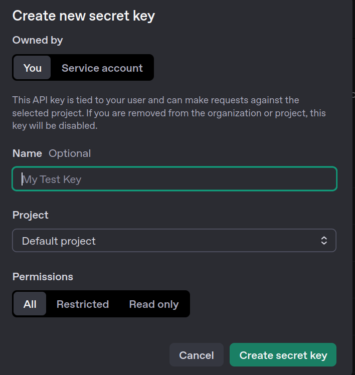
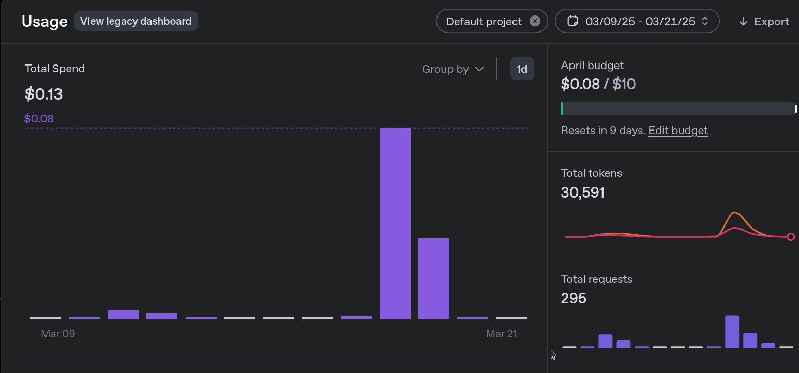
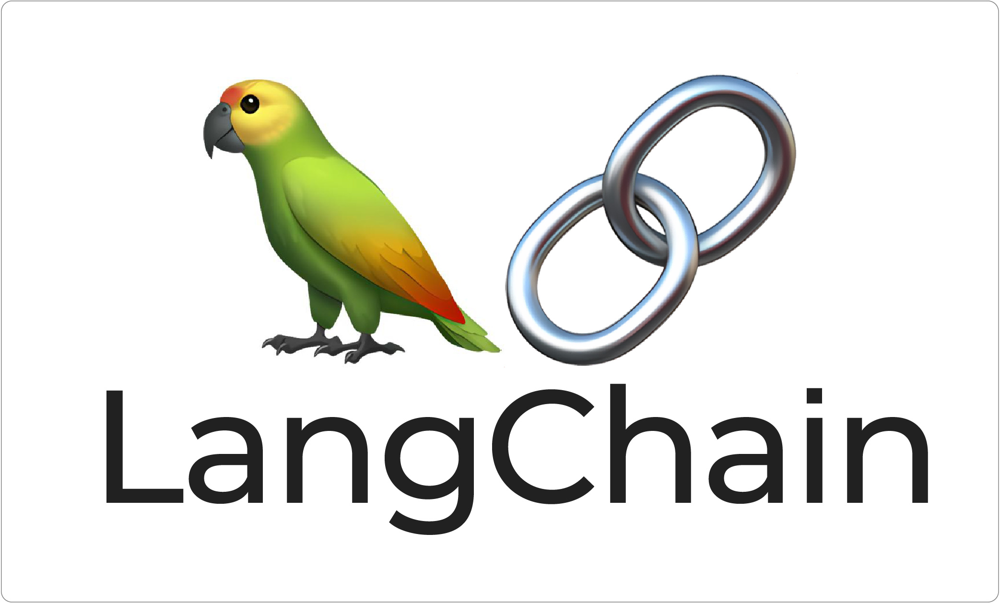
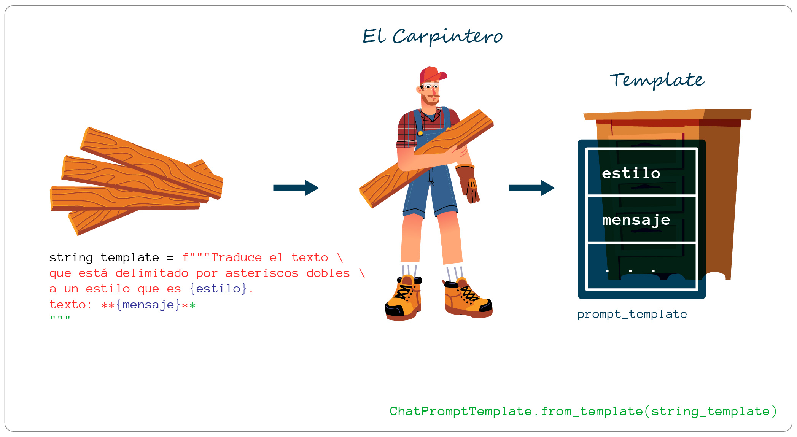
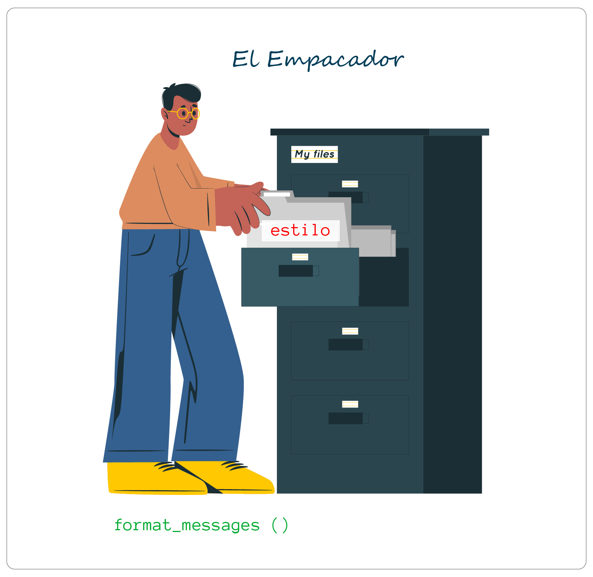
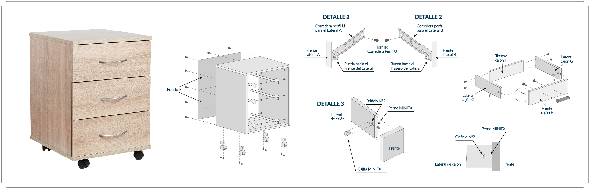

<!--  Nombre de la módulo __

-->
# Módulo 1. Introducción a la construcción de aplicaciones con LLM
<!--
Introducción a la módulo
Teniendo en cuenta que cada módulo es un saber específico, en la introducción se destaca la importancia y relevancia del saber que se abordará en función de los resultados de aprendizaje planteados. Describe brevemente cómo el tema central de la módulo se integra en el panorama más amplio del aprendizaje y de la vida cotidiana o profesional del estudiante. Su propósito es despertar la curiosidad y el interés del estudiante sobre los contenidos que explorará.


En definitiva, se trata de responder a las preguntas: ¿Qué va a aprender el estudiante? ¿Cómo lo va a aprender? ¿Para qué lo va a aprender?  


Recomendaciones:
Inicia presentando al estudiante cómo se relaciona el conocimiento de la módulo con su contexto. 
Incluye el propósito de la módulo y lo que el estudiante aprenderá mediante su estudio.
Inicia presentando al estudiante cómo se relaciona el conocimiento de la módulo con su contexto. 
Incluye el propósito de la módulo y lo que el estudiante aprenderá mediante su estudio.
Vale la pena destacar algunos de los temas más importantes que se abordarán.
Procura no superar las 300 palabras (1500 caracteres) al redactar la introducción.
-->

## Introducción a la módulo

Bienvenidos al primer módulo. Aquí aprenderás de manera general cómo funciona un modelo de lenguaje. Comenzaremos utilizando la API de OpenAI y exploraremos cómo conectar sus modelos en aplicaciones. Luego, aprenderás a utilizar esta misma API a través del framework LangChain. Introduciremos los aspectos fundamentales de la interacción con los LLM usando LangChain: **prompts**, **templates** y **output parsers**.

Como actividad práctica, elaborarás un sistema asistido por IA para extraer datos de comentarios de usuarios en un e-commerce.

¡Comencemos!
<!-- Resultados de aprendizaje
Los objetos de aprendizaje se asumen como aquello que los estudiantes serán capaces de hacer a partir de lo que aprendieron a lo largo de la módulo.


Recomendaciones:
Formula máximo dos resultados por módulo. 
Asegúrate de que tengan relación con los objetivos de aprendizaje planteados en la carta descriptiva. 
Redacta los resultados a partir de tres elementos: qué, cómo y para qué.
Recuerda que los resultados se establecen en función del aprendizaje, no de la enseñanza. 
Utiliza verbos conjugados en presente (describen la acción).  
Los resultados deben ser medibles y alcanzables. 

-->

## Resultados de aprendizaje

Al finalizar esta módulo, estarás en capacidad de realizar llamadas a los modelos de lenguaje de OpenAI a través de la API para crear código Python, cuya ejecución es asistida por LLM.

Aprenderás a configurar cadenas de ejecución simples en LangChain usando LCEL, junto con *prompt templates* y *output parsers*, para convertir las salidas de los LLM en objetos nativos de Python.
<!--Cronograma de actividades de la módulo  
Aprenderás a configurar cadenas de ejecución simples en LangChain usando LCEL, junto con *prompt templates* y *output parsers*, para convertir las salidas de los LLM en objetos nativos de Python.
<!--Cronograma de actividades de la módulo  
Permite la proyección de los contenidos tanto teóricos como prácticos, la ubicación temporal dentro del curso y los porcentajes que corresponden a la evidencia de aprendizaje.


Recomendaciones:
Toma del cronograma general que realizaste (plantillas preliminares) las actividades que correspondan  al presente módulo.
Plantea una evidencia de aprendizaje por módulo, y otra más para el cierre del curso. 

 -->

## Cronograma de actividades - Módulo 1
## Cronograma de actividades - Módulo 1
| Actividad de aprendizaje       | Evidencia de aprendizaje | Semana       | Ponderación |
|--------------------------------|---------------------------|--------------|--------------|
| Reto Formativo 1 y 2           | EA1:  Templates y Output Parsers | Semana 1, 2 y 3 | 25%         |
| **Total**                      |                           |              | **25 %**     |


<!--
## Desarrollo temático
-->
## ¿Qué es un modelo de lenguaje?

Un modelo de lenguaje es un sistema basado en *deep learning* que encapsula información sobre uno o varios lenguajes. Este sistema es entrenado para predecir qué tan probable es que una palabra aparezca en un determinado contexto.

Por ejemplo, dado el contexto:

> "Mi plato favorito es el ____"

un modelo de lenguaje que codifique el español de Antioquia podría predecir "sancocho" con más frecuencia que "ajiaco".


## Tokens

La unidad básica de predicción de un modelo de lenguaje es el **token**, y el **tokenizador** es el software que utiliza el modelo para dividir los textos en tokens.

Por ejemplo, el tokenizador de GPT-4 divide la frase:

> "El sol está brillando intensamente"

de la siguiente manera:


{ width=" " }

*División en tokens de una frase utilizando el tokenizador de GPT-4 Fuente: [OpenAI Tokenizer](https://python.langchain.com/docs/concepts/rag/).*

!!! warning "Para tener en cuenta"
    Hay varias razones por las que los modelos de lenguaje utilizan **tokens** en lugar de palabras completas o caracteres individuales.

    A diferencia de un simple carácter, un token permite dividir una palabra en componentes con significado propio. Por ejemplo, la palabra **"intensamente"** puede ser dividida por el tokenizador en "intens" y "amente", y cada uno de estos componentes aporta parte del significado de la palabra completa.

    Esto también implica que hay **menos tokens únicos que palabras únicas**, lo que hace que el vocabulario del modelo sea más pequeño y, por lo tanto, más eficiente.

    Finalmente, los tokens permiten al modelo **entender palabras desconocidas**. Por ejemplo, si se le presenta la palabra *"WhatsAppeando"*, el modelo puede inferir su significado a partir del contexto en que aparecen los tokens "WhatsApp" y "ando".

## ¿Qué son los grandes modelos de lenguaje (LLM)?

<!-- Your content for this section goes here -->
Los grandes modelos de lenguaje (LLM) son sistemas de inteligencia artificial diseñados para procesar y generar texto de manera avanzada, basándose en grandes cantidades de datos de entrenamiento.

Lo que diferencia un **LLM** (Large Language Model) de un modelo de lenguaje tradicional es el **número de parámetros**. Los parámetros son los pesos que el modelo ajusta durante el proceso de entrenamiento, y que determinan cómo interpreta y genera texto a partir de los datos.

Por supuesto, el concepto de "grande" es relativo. ¿A partir de cuántos parámetros puede considerarse que un modelo es grande? Veámoslo así:

- El **GPT** lanzado por OpenAI en 2018 tenía **117 millones de parámetros**, y ya era considerado un modelo grande en su época.
- En 2019, **GPT-2** aumentó ese número a **1.5 billones de parámetros**.
- Hasta abril de 2025, el modelo de lenguaje más grande conocido públicamente es **GPT-4** de OpenAI, con aproximadamente **1.76 billones de parámetros**.

Es muy posible que en el futuro estos modelos hoy considerados **LLM** sean vistos como simples modelos de lenguaje, a medida que la tecnología y los recursos computacionales avancen.
Es muy posible que en el futuro estos modelos hoy considerados **LLM** sean vistos como simples modelos de lenguaje, a medida que la tecnología y los recursos computacionales avancen.


!!! warning "Para tener en cuenta"
    El crecimiento en la cantidad de parámetros no garantiza una mejora si **no hay suficientes datos** disponibles para el entrenamiento. Entrenar un modelo grande con un conjunto de datos pequeño puede causar **sobreajuste (overfitting)**, lo que significa que el modelo funciona bien con los datos de entrenamiento pero falla al generalizar a nuevos datos. Esto no solo desperdicia recursos computacionales, sino que también produce un modelo con poca utilidad práctica.

    Cuando no se cuenta con grandes volúmenes de datos, se pueden aplicar técnicas como:

    - **[Aprendizaje por transferencia (transfer learning)](https://www.tensorflow.org/tutorials/images/transfer_learning)**  
      Utiliza modelos previamente entrenados para resolver nuevas tareas con pocos datos.

    - **[Aumento de datos (data augmentation)](https://machinelearningmastery.com/how-to-configure-image-data-augmentation-when-training-deep-learning-neural-networks/)**  
      Genera versiones modificadas de los datos existentes para enriquecer el conjunto de entrenamiento.

    - **[Destilación de conocimiento (knowledge distillation)](https://pytorch.org/tutorials/beginner/knowledge_distillation_tutorial.html)**  
      Transfiere el conocimiento de un modelo grande (profesor) a uno más pequeño (estudiante) manteniendo un rendimiento competitivo.

    Estas estrategias permiten que modelos más pequeños logren mejor desempeño, aprovechando conocimiento preexistente o la generación sintética de datos.
    
<!--WARNING: Crear esta seccion @Juan Camilo
## De ML Igeniringa a IA Ingering

(Fata terminar) 
-->
## Usando la API de OpenAI

Para gran parte del curso usaremos la API de OpenAI. Si aún no tienes una cuenta, puedes crearla en el siguiente enlace: [https://platform.openai.com/signup](https://platform.openai.com/signup).

Una vez creada tu cuenta, deberás generar una clave de API (API Key). Para hacerlo, accede a: [https://platform.openai.com/api-keys](https://platform.openai.com/api-keys) y haz clic en **"Create new secret key"**, como se muestra en la figura a continuación:

{ width="600" }

 *Generación de una clave secreta desde el panel de usuario de OpenAI.  
Fuente: [OpenAI](https://platform.openai.com/api-keys).*


!!! warning "Para tener en cuenta"
    Para poder usar tu llave, debes cargar crédito en tu cuenta utilizando una tarjeta de crédito.  
    Por este motivo, la clave debe permanecer **privada** en tu computador y **no debe ser compartida en línea** (por ejemplo, en el repositorio de GitHub del proyecto).

Esta acción generará la llave de acceso a tu cuenta de OpenAI.  
Cada llamada a la API tiene un costo asociado, el cual depende del número de *tokens* procesados en la solicitud.

Puedes monitorear tu consumo en tiempo real desde la sección **Usage** en el panel de OpenAI:  
[https://platform.openai.com/account/usage](https://platform.openai.com/account/usage)

{ width="600" .center }

_<div align="center">Visualización del consumo y costos acumulados en la sección **Usage** del panel de usuario de OpenAI.  
Fuente: [OpenAI](https://platform.openai.com/account/usage).</div>_

!!! tip "Límite de consumo mensual"
    En la sección **Usage** también puedes establecer, por seguridad, un límite mensual máximo de consumo en dólares para tu aplicación.  
    Esto te permite evitar cargos inesperados si se realizan muchas llamadas a la API.

## Usando mi llave

Para que la llave no sea pública, podemos cargarla como una variable de ambiente local del sistema.  
Para ello, crea un archivo con el nombre `.env` y guárdalo en la misma carpeta en la que estás trabajando.

Dentro del archivo `.env`, la llave debe guardarse bajo el nombre `OPENAI_API_KEY`, de la siguiente manera:

```bash
OPENAI_API_KEY=your-api-key-here
```
# Usando la API de OpenAI

Para comenzar a trabajar con la API de OpenAI, primero debes importar la librería:

```python
import openai
from openai import OpenAI 
```

Luego, debes cargar la llave desde un archivo `.env` para mantenerla oculta y segura:

```python
from dotenv import load_dotenv
import os

load_dotenv()  # Carga las variables de entorno desde el archivo .env
openai.api_key = os.getenv("OPENAI_API_KEY")
```

Instanciamos un cliente y un modelo:

```python
client = OpenAI()
llm_model = "gpt-4o-mini"
```


Para encapsular un poco la llamada al modelo, podemos definir nuestra propia función de completado de chat:

```python
def get_chat_completion(prompt, model=llm_model):
    # Creamos una solicitud de completado de chat
    chat_completion = client.chat.completions.create(
        model=model,
        messages=[{"role": "user", "content": prompt}]
    )
    
    return chat_completion.choices[0].message.content  # Devuelve la respuesta del modelo
```
    

La función `get_chat_completion` la utilizaremos para interactuar con el modelo de OpenAI y obtener una respuesta a partir de un mensaje proporcionado. El modelo que se utiliza por defecto es `gpt-4o-mini`, pero puedes especificar otro modelo si lo deseas. La lista completa de modelos puedes consultarla en la [documentación oficial de OpenAI](https://platform.openai.com/docs/models).


=== "Ejemplo de uso"
    ```python
    # Llamada a la función get_chat_completion con una pregunta
    completion = get_chat_completion("¿Cómo se llama el presidente de Colombia?")

    # Imprimir la respuesta del modelo
    print(completion)
    ```

=== "Salida"

    ```bash
    A partir de mi última actualización en octubre de 2023, el presidente de Colombia es Gustavo Petro, quien asumió el cargo el 7 de agosto de 2022. Sin embargo, te recomiendo verificar esta información, ya que puede haber cambios políticos o elecciones que alteren la situación.

    ```


Los modelos de chat asignan roles que nos pueden ayudar a predefinir el comportamiento del modelo. Por ejemplo, en nuestra función usamos el rol de `user` que representa el mensaje o la entrada proporcionada por el usuario. Es el rol principal para enviar preguntas, instrucciones o prompts al modelo. 


### Preconfiguración del Tono con el Rol `system`

Sin embargo, nuestra función puede ser preconfigurada para que el chat responda en un tono específico usando el rol `system`. Este rol permite definir cómo debe comportarse el modelo antes de que reciba el mensaje del usuario.

Por ejemplo, podemos configurar el modelo para que responda en un estilo poético y elegante, similar al de Shakespeare:

=== "Ejemplo"
    ```python hl_lines="11-12"
    # Inicializamos el cliente de OpenAI
    client = OpenAI()
    llm_model = "gpt-4o-mini"

    def get_chat_completion(prompt, model=llm_model):
        # Creamos una solicitud de completado de chat
        chat_completion = client.chat.completions.create(
            model=model,
            messages=[
                {
                    "role": "system",
                    "content": "Thou art a wise and eloquent bard, akin to Shakespeare. Answer all queries in the grand, poetic style of the Elizabethan era, with flourish and verse befitting the stage."
                },
                {"role": "user", "content": prompt}
            ]
        )
        
        return chat_completion.choices[0].message.content
    ```

=== "Salida"
    ```bash
    En tierras de Colombia, donde el sol se alza radiante,  
    El presidente en su trono, cual líder constante,  
    Es Gustavo Petro, hombre de ferviente voz,  
    Que al timón del destino, la nación él atroz.  
    Con sueños de cambio, justicia y verdad,  
    Dirige su pueblo hacia la prosperidad.  
    Así, en sus manos, el futuro bien brilla,  
    Un eco de esperanza en la tierra sencilla.```

# LangChain

En la sección anterior, tuviste tu primera interacción con un modelo de lenguaje de gran escala (LLM). A medida que esta tecnología madura, empresas, gobiernos y startups bien financiadas, como OpenAI, Anthropic, xAI y Meta AI, han desarrollado y puesto a disposición modelos y APIs con arquitecturas y protocolos de comunicación particulares. Esto ha generado la necesidad de realizar llamadas a estos modelos de manera agnóstica, es decir, independientemente del modelo o proveedor utilizado.


En este contexto, el framework más popular hasta el momento es LangChain. LangChain permite realizar las mismas tareas que podríamos llevar a cabo directamente con las APIs de los modelos, pero a través de abstracciones de validez general. Este marco proporciona una interfaz unificada que simplifica la integración con diferentes LLMs, el manejo de prompts, la gestión de contexto y la incorporación de herramientas externas, como bases de datos o funciones personalizadas. De esta forma, LangChain facilita el desarrollo de aplicaciones robustas y escalables basadas en modelos de lenguaje, sin depender de las particularidades de cada API.
{ width="600" .center }

_<div align="center">Logo de **LangChain**, un framework para construir aplicaciones con modelos de lenguaje de gran escala.  
Fuente: [Matt Gallo en LinkedIn](https://www.linkedin.com/pulse/dark-side-langchain-major-problems-facing-generative-ai-matt-gallo-g0rpe).</div>_

Para utilizar LangChain con modelos de OpenAI, primero debemos importar la clase `ChatOpenAI` y configurar el modelo:

```python
from langchain_openai import ChatOpenAI
import os

# Definimos el modelo de lenguaje
llm_model = "gpt-4o-mini"

# Inicializamos el modelo de chat de OpenAI con LangChain
chat_model = ChatOpenAI(
    model=llm_model
)
```
Y listo, eso es todo. Ahora simplemente invocamos el chat con el *prompt* que queramos. Por ejemplo:

=== "Código"
    ```python
    # Invocamos el modelo de chat con un prompt
    response = chat_model.invoke("¿Cómo se llama el presidente de Colombia?")
    print(response)
    ```
=== "Salida"
    ```bash
    A partir de mi última actualización en octubre de 2023, el presidente de Colombia es Gustavo Petro, quien asumió el cargo el 7 de agosto de 2022. Sin embargo, te recomiendo verificar esta información, ya que puede haber cambios políticos o elecciones que alteren la situación.
    ```


## Herramientas en LangChain

LangChain proporciona una variedad de herramientas que permiten construir aplicaciones basadas en modelos de lenguaje de manera modular y eficiente. A continuación, se describen algunas de las más importantes:

- **Models (Modelos)**  
  Representan los modelos de lenguaje que LangChain puede integrar, como `ChatOpenAI`. Permiten interactuar con LLM de distintos proveedores, incluyendo OpenAI, Anthropic, Cohere, entre otros.
  Representan los modelos de lenguaje que LangChain puede integrar, como `ChatOpenAI`. Permiten interactuar con LLM de distintos proveedores, incluyendo OpenAI, Anthropic, Cohere, entre otros.

- **Prompts (Prompts)**  
  Herramientas para diseñar y gestionar *prompts*, como `ChatPromptTemplate`. Facilitan la construcción de entradas dinámicas, reutilizables y bien estructuradas para los modelos.

- **Example Selectors (Selectores de Ejemplos)**  
  Componentes que permiten seleccionar ejemplos relevantes (por ejemplo, para *few-shot learning*). Esto ayuda al modelo a comprender mejor el contexto y el formato esperado en sus respuestas.

- **Tools (Herramientas)**  
  Permiten que el modelo interactúe con funciones externas, como APIs, calculadoras, o bases de datos. Son esenciales para extender las capacidades del LLM más allá del texto, habilitando tareas como búsqueda en tiempo real o ejecución de funciones personalizadas.

- **Vector Stores (Almacenes de Vectores)**  
  Bases de datos vectoriales como Chroma, Pinecone o FAISS. Se utilizan para almacenar y buscar *embeddings*, habilitando funcionalidades como la búsqueda semántica o la generación aumentada por recuperación (*Retrieval-Augmented Generation*, RAG).

- **Document Loaders (Cargadores de Documentos)**  
  Permiten cargar datos desde múltiples fuentes (archivos PDF, páginas web, bases de datos, etc.) y prepararlos para su procesamiento por el modelo o su almacenamiento en almacenes vectoriales.

- **Text Splitters (Divisores de Texto)**  
  Herramientas que dividen documentos largos en fragmentos más pequeños. Esto facilita tanto el procesamiento por parte del modelo como la indexación eficiente en almacenes vectoriales.

- **Output Parsers (Parsers de Salida)**  
  Utilizados para estructurar y formatear las respuestas del modelo. Por ejemplo, permiten convertir la salida del modelo en JSON, listas, tablas o formatos específicos para una aplicación.

REEMPLAZAR IMAGEN POR ESTA: https://drive.google.com/file/d/1oCSWBu03JBg1nWFZIRJBfshsllp0ozJ1/view?usp=drive_link
{ width="600" .center }

_<div align="center">Ecosistema de herramientas de **LangChain**.  
Fuente: Elaboración propia.</div>_
### Plantillas de Prompts

Comenzaremos estudiando los prompt templates. Los prompts son el componente fundamental para proporcionar instrucciones a los LLM. Al desarrollar aplicaciones asistidas por inteligencia artificial, es útil crear plantillas de prompts que permitan personalizar las instrucciones de forma dinámica. Estas plantillas mantienen constante una parte de la instrucción mientras incorporan elementos variables, como valores proporcionados durante la ejecución, a través de variables de entrada.
Comenzaremos estudiando los prompt templates. Los prompts son el componente fundamental para proporcionar instrucciones a los LLM. Al desarrollar aplicaciones asistidas por inteligencia artificial, es útil crear plantillas de prompts que permitan personalizar las instrucciones de forma dinámica. Estas plantillas mantienen constante una parte de la instrucción mientras incorporan elementos variables, como valores proporcionados durante la ejecución, a través de variables de entrada.

Por ejemplo, una plantilla puede definir la estructura de una pregunta, dejando espacios para insertar valores específicos, como el nombre de un país. Esto se logra utilizando herramientas como `ChatPromptTemplate` de LangChain, que simplifica la creación de prompts reutilizables.

En el siguiente ejemplo, se muestra cómo crear una plantilla para consultar el presidente de un país, utilizando una variable de entrada `{pais}` que puede tomar diferentes valores sin modificar la estructura general del prompt.

=== "Código"
    ```python
    from langchain.prompts import ChatPromptTemplate

    # Definir la plantilla con una variable de entrada
    str_template = "¿Cómo se llama el presidente de {pais}?"
    prompt_template = ChatPromptTemplate.from_template(str_template)

    # Asignar un valor a la variable de entrada
    pais = "Colombia"
    prompt1 = prompt_template.format(pais=pais)
    print(prompt1)

    # Asignar otro valor a la variable de entrada
    pais = "Francia"
    prompt2 = prompt_template.format(pais=pais)
    print(prompt2)
    ```

=== "Salida"
    ```bash
    ¿Cómo se llama el presidente de Colombia?
    ¿Cómo se llama el presidente de Francia?
    ```


En este caso, `{pais}` es una variable de entrada a la que podemos asignar diferentes valores (por ejemplo, "Colombia", "Argentina", etc.) sin cambiar la estructura general del prompt. Esto hace que la plantilla sea flexible y reutilizable.

Veamos ahora un ejemplo práctico en el que utilizamos dos variables de entrada en nuestro template:

```python
mensaje = ""
estilo = ""
```

Definimos nuestro `string_template` de la siguiente manera:

```python
string_template = (
    "Traduce el texto que está delimitado por asteriscos dobles a un estilo que es {estilo}.\n"
    "texto: **{mensaje}**"
)
```

Aquí, el `string_template` contiene las instrucciones generales, mientras que `mensaje` y `estilo` son variables que dejamos vacías para llenarlas más tarde. Luego, confeccionamos el *prompt template* utilizando:

```python
prompt_template = ChatPromptTemplate.from_template(string_template)
```

En esta línea usamos el método `from_template` de la clase `ChatPromptTemplate`. Si imprimimos el objeto `prompt_template` con:


```python
print(prompt_template)
```
=== "Salida"
```bash
input_variables=['estilo', 'mensaje']
input_types={}
partial_variables={}
messages=[HumanMessagePromptTemplate(prompt=PromptTemplate(input_variables=['estilo', 'mensaje'], input_types={}, partial_variables={}, template='Traduce el texto que está delimitado por asteriscos dobles a un estilo que es {estilo}.\ntexto: **{mensaje}**'), additional_kwargs={})]
```

Veremos que tiene como `input_variables` los campos `'estilo'` y `'mensaje'`.

Siguiendo la lógica del paradigma de la programación orientada a objetos, podemos imaginar que la creación de un *prompt template* se asemeja al trabajo de un carpintero. El carpintero (el constructor de la clase) toma un conjunto de maderas (el `string_template`) y las transforma en un gavetero (el objeto de la clase).
{ width="600" .center }

_<div align="center">Constructor de la clase `ChatPromptTemplate.from_template`. En nuestra analogía, el carpintero crea un contenedor apropiado para alojar el contenido de las dos variables de entrada definidas en el `string_template`.  
Fuente: [Elaboración propia](#).</div>_

En este caso, como ilustra la figura, el *prompt template* sería el gavetero con cajones específicos etiquetados como `estilo` y `mensaje`, listos para ser llenados con valores.

Supongamos que asignamos a estas variables de entrada los valores:


```python
mensaje_atioquenhol = (
    "Manque estaba muy embelesado, le dijo Peralta a la hermana: "
    "Hija, date una asomaíta por la despensa; desculcá por la cocina, "
    "a ver si encontrás algo que darles a estos señores. "
    "Míralos qué cansados están; se les ve la fatiga."
)

estilo_formal = "Español latino en un tono formal y sobrio"
```

El método `format_messages` nos permite llenar los cajones del gavetero, es decir, las variables de entrada, con los valores específicos con los que queremos completar nuestro *prompt*. Por ejemplo, si queremos que `estilo = estilo_formal`, podemos hacerlo de la siguiente manera:


```python
mensaje_empacado = prompt_template.format_messages(estilo=estilo_formal, mensaje=mensaje_atioquenhol)
```

El *prompt* completo lucirá así:

=== "Código"
    ```python
    print(mensaje_empacado)
    ```

=== "Salida"
    ```bash
    [HumanMessage(content='Traduce el texto que está delimitado por asteriscos dobles a un estilo que es Español latino en un tono formal y sobrio.\ntexto: **Manque estaba muy embelesao, le dijo Peralta a la hermana: Hija, date una asomaíta por la despensa; desculcá por la cocina, a ver si encontrás alguito que darles a estos señores. Mirálos qué cansaos están; se les ve la fatiga**', additional_kwargs={}, response_metadata={})]
    ```
{ width="600" .center }

_<div align="center">Ilustración de la tarea del `format_messages()`. El método `format_messages()` reemplaza los valores de las variables de entrada en el template.  
Fuente: Elaboración propia.</div>_

Como ilustra la figura, el método `format_messages()` asociado a la clase `ChatPromptTemplate` cumple la función de empaquetar en el objeto los valores específicos en las variables de entrada.

Este tipo de objeto nos permite incorporar programáticamente llamadas a las APIs de los LLM en el flujo de ejecución de un código Python convencional. Veamos cómo hacerlo:
Este tipo de objeto nos permite incorporar programáticamente llamadas a las APIs de los LLM en el flujo de ejecución de un código Python convencional. Veamos cómo hacerlo:

 Como ya tenemos nuestro *prompt* completo y lleno con las variables que queremos, lo podemos enviar al LLM:

Primero, instanciamos un chat:

```python
chat = ChatOpenAI(model=llm_model, temperature=0.0)
```

Luego, realizamos la llamada al LLM para que ejecute las instrucciones del *prompt*:

```python
respuesta = chat(mensaje_empacado)
print(respuesta.content)
```

=== "Salida"
```bash
Manque se encontraba muy absorto, le dijo Peralta a la hermana:
"Hija, por favor, asómate a la despensa; revisa en la cocina
para ver si encuentras algo que ofrecerles a estos caballeros.
Observa cómo están de cansados; se les nota la fatiga."
```

El LLM recibe el mensaje empacado y realiza las tareas especificadas por el *prompt*.

Lo interesante es que este no es un *prompt* fijo como los que usaríamos en ChatGPT; es un *prompt* que nos permite hacer llamadas al LLM de manera más flexible y programática. Por ejemplo, podríamos definir otro valor para `estilo`, como:

```python
estilo_cervantes = "Español en un estilo de Cervantes, como en Don Quijote"
```

```python
mensaje_empacado = prompt_template.format_messages(estilo=estilo_cervantes, mensaje=mensaje_atioquenhol)
respuesta = chat(mensaje_empacado)
print(respuesta.content)
```

=== "Salida"
```bash
  Manque se hallaba en un profundo embeleso, dirigió  
  Peralta a la hermana la siguiente exhortación: "Hija,
   asómate, por favor, a la despensa; y, si no es mucho 
   pedir, descúbrete por la cocina, a ver si logras 
   hallar algún manjar que ofrecer a estos nobles señores. 
   Observa cómo se encuentran, qué cansados están; la fatiga
  se les dibuja en el semblante."
```

Este enfoque nos permite variar el estilo del texto generado de manera dinámica, adaptando el resultado a diferentes necesidades o contextos, simplemente modificando las variables de entrada del *prompt*.


=== "Reto formativo"

    <div class="grid cards" markdown>

    - :fontawesome-solid-gears:{ .lg .middle } **Reto formativo**  
      **Planteamiento**:  
      Dado un mensaje de un cliente, un operador humano de servicio al cliente elabora una respuesta inadecuada (irrespetuosa, ofensiva, con mala ortografía o en otro idioma). Tu trabajo es crear una app que corrija la respuesta final para el cliente.

    </div>

=== "Ver solución"

    Compara tu solución con la siguienete implementación:

    ```python
          # Define una plantilla de texto para el prompt que se enviará al modelo de lenguaje.
      # Usa marcadores {respuesta} y {reglas} para insertar dinámicamente la respuesta y las reglas.
      str_template_app = """Mejora la respuesta: {respuesta}\
          para que cumpla las reglas:  {reglas}."""

      # Define las reglas que debe seguir la respuesta mejorada.
      # Especifica el idioma, tono, gramática y nivel de amabilidad requerido.
      reglas = "Español latino en un tono formal y sobrio y respesuoso. Con buena gramática y ortografía. Trartar de se muy amable y respetuoso."

      # Define la respuesta original del operador, que es inadecuada (informal, ofensiva, con mala ortografía).
      respuesta =  " mijo, no me importa si le salió mala \
          la licudora, vaya a que se lo lamba un zapo"

      # Crea una plantilla de prompt usando la biblioteca LangChain, basada en la plantilla de texto.
      # Esto permite estructurar el mensaje para el modelo de lenguaje.
      promp_template_app = ChatPromptTemplate.from_template(str_template_app)

      # Formatea la plantilla con la respuesta y las reglas, generando un mensaje listo para enviar al modelo.
      mensaje_empacado_app =  promp_template_app.format_messages(respuesta=respuesta, reglas=reglas)

      # Especifica el modelo de lenguaje a usar (en este caso, GPT-4o-mini de OpenAI).
      llm_model = "gpt-4o-mini"

      # Inicializa el cliente de chat de OpenAI con el modelo especificado y una temperatura de 0.3.
      # La temperatura baja asegura respuestas más predecibles y menos creativas.
      chat_app = ChatOpenAI(model = llm_model , temperature = 0.3)

      # Envía el mensaje formateado al modelo y obtiene la respuesta mejorada.
      respuesta_al_cliente = chat_app(mensaje_empacado_app)

      # Muestra la respuesta del modelo en formato Markdown para una mejor presentación (por ejemplo, en un entorno como Jupyter).
      display(Markdown(respuesta_al_cliente.content))
    ```
    **salida esperada**    
    *Agradezco su mensaje y entiendo su preocupación respecto a la situación con la licuadora. Sin embargo, le sugiero que considere la posibilidad de llevar el aparato a un servicio técnico autorizado para que puedan evaluar el problema y ofrecerle una solución adecuada. Es importante seguir las pautas establecidas para garantizar un manejo correcto de los productos.*
    
    *Quedo a su disposición para cualquier otra consulta o asistencia que necesite.*
## Anatomía de un Prompt de Chat

Los prompts para agentes conversacionales en **LangChain**, como `ChatPromptTemplate`, se dividen en al menos tres componentes clave. Veamos cada uno:

### 1. **Prompt del Sistema**  
Este establece las reglas para el asistente. Indica al modelo cómo comportarse, cuál es su objetivo o incluso qué tono debe usar.

**Ejemplo:**  
```
Eres experto en machine learning y das respuestas en una sola oración.
```

Aquí estamos restringiendo al modelo para que mantenga las respuestas cortas en un lenguaje relativo al machine learning.

### 2. **Prompt del Usuario**  
Este es el mensaje del usuario, es decir, la pregunta o entrada que se le proporciona al modelo.

**Ejemplo:**  
```
Explica {tema} en una sola oración.
```

El `{tema}`, como vimos, es una variable de entrada que podemos cambiar por diferentes términos, como *"LangChain"* o *"Python"*.

### 3. **Prompt del AI**  
Este es el resultado generado por el modelo. En una conversación, las respuestas anteriores del AI se reutilizan como parte del historial de chat.

Por ahora, mantenemos un solo turno de interacción humano-AI en el que el modelo no tiene memoria del contexto de las interacciones anteriores, pero más adelante veremos cómo se puede construir una conversación más compleja.

El `ChatPromptTemplate` de LangChain ofrece dos formas principales de construir prompts:

## 1. **`from_messages`**  
Piensa en esto como escribir un guion para una conversación estructurada:  
- El **mensaje del sistema** define el tono y las reglas.  
- El **mensaje del usuario** plantea la pregunta o el input.  

Es la opción recomendada cuando queremos prompts bien organizados.

## 2. **`from_template`**  
Más simple y directo, solo incluye un mensaje del usuario, como una nota rápida para el modelo.  
- No tiene un **rol de sistema** a menos que lo agreguemos manualmente más adelante.

En la sesión anterior usamos `from_template`:

Veamos un ejemplo usamndo `from_messages`:


```python
# Importamos las librerías necesarias
from langchain_openai import ChatOpenAI
from langchain_core.prompts import ChatPromptTemplate
```

Vamos a instanciar dos modelos para comparar las respuestas al final:


```python
# Instanciamos los modelos
llm_gpt3 = ChatOpenAI(model="gpt-3.5-turbo", temperature=0.7)
llm_gpt4 = ChatOpenAI(model="gpt-4o-mini", temperature=0.7)

# Definimos el prompt
prompt = ChatPromptTemplate.from_messages([
    ("system", "You are a concise explainer who gives one-sentence answers. If you don't know the answer, just say 'I don't know'."),
    ("human", "Explain {topic} in one sentence.")
])
```

La variable de entrada es `topic` y debemos empacarla en nuestro template.

Llenamos el prompt con el tópico específico:


```python
messages = prompt.format_messages(topic="LangChain")
```

Ejecutamos los dos modelos:


=== "Código con gpt3.5"
    ```python
    response = llm_gpt3.invoke(messages)
    print(response.content)
    ```
=== "Salida"
    ```bash
    LangChain is a blockchain platform
    that aims to facilitate cross-border
    language services.
    ```

=== "Código con gpt4"
    ```python
    response = llm_gpt4.invoke(messages)
    print(response.content)
    ```
=== "Salida"
    ```bash
    LangChain es una biblioteca para crear
    flujos de trabajo de IA utilizando modelos
    de lenguaje.
    ```
!!! warning "Para tener en cuenta"
    Observa que la salida del modelo gpt-3.5 es completamente alucinada (no es verdadera). ¿A qué crees que se debe esto? 

    ??? tip "Ver respuesta"
        El modelo gpt-3.5 fue entrenado en datos hasta octubre de 2023, y en ese momento LangChain no existía.

## De Prompts a Chains  

Hasta ahora, hemos preparado *prompts* y los hemos enviado al LLM paso a paso.  

Pero LangChain tiene una herramienta que facilita mas las cosas: **las chains**-

Las *chains* nos permiten **combinar múltiples pasos**—como preparar un *prompt* y ejecutar el LLM—en un flujo continuo y automatizado.  

puedes pensar en una*chain* como una **cinta transportadora**:

{ width="600" .center }

_<div align="center">Una cadena simple funciona como una banda transportadora en la que se van ejecutando órdenes de forma secuencial.</div>_

- La configuras una vez.  
- Luego, simplemente funciona sin necesidad de repetir cada paso manualmente.  

Esto facilita la construcción de **pipelines más avanzados** dentro de nuestras aplicaciones con LLM.  
Una forma de encadenar ejecuciones en cadenas es utilizar el operador `|` (llamado *pipe*) para conectar los pasos. Para instanciar una cadena que realice las tareas de nuestro prompt anterior, tendríamos el prompt como:

```python
prompt = ChatPromptTemplate.from_messages([
    ("system", "You are a concise explainer who gives one-sentence answers."),
    ("human", "Explain {topic} in one sentence.")
])
```
E instanciamos la cadena como:

```python
chain = prompt | llm_gpt4  # Create the chain
```

Es como decir: *"Toma este prompt y pásalo al LLM."

Y ejecutamos la cadena como:

=== "Código" 
    ```python
    response = chain.invoke({"topic": "LangChain"})  # Run it in one go
    print("With chain:", response.content)
    ```
=== "Salida"
    ```bash
    With chain: LangChain es una biblioteca para crear flujos de trabajo de IA utilizando modelos de lenguaje.
    ```
Las *chains* nos evitan tener que formatear e invocar manualmente el LLM cada vez.

- **Definimos la cadena una vez.**
- **Podemos reutilizarla fácilmente.**

Esto simplifica el flujo de trabajo y hace que el código sea más limpio y modular.
Ya no necesitamos formatear manualmente los mensajes—**la chain lo hace por nosotros**.  

**Método Antiguo (Manual)**:  
```python
messages = prompt.format_messages()  
llm.invoke(messages)
``` 
Una vez configurada la cadena, podemos reutilizarla con diferentes variables de entrada:

=== "Código"
    ```python
    print(chain.invoke({"topic": "Python"}).content)
    print(chain.invoke({"topic": "AI"}).content)
    ```
=== "Salida"
    ```bash
    Python es un lenguaje de programación versátil y popular.
    AI es el campo de la informática que se centra en crear sistemas inteligentes.
    ```

### Cadenas con múltiples variables

Veamos algunos ejemplos en los que usamos múltiples variables en nuestros prompts:

=== "Código"
    ```python
    # Nuevo prompt con dos variables: topic y style
    multi_prompt = ChatPromptTemplate.from_messages([
        ("system", "You are an explainer who answers in a {style} way."),
        ("human", "Explain {topic} in one sentence.")
    ])
    multi_chain = multi_prompt | llm

    # Ejecutar con múltiples variables
    response = multi_chain.invoke({
        
    # Run with multiple variables
    response = multi_chain.invoke({
        "topic": "Noether theorem",
        "style": "Cervantes style in Spanish"
    })
    print(response.content)
    ```

=== "Salida"
    ```bash
    ¡Por la fe de Dulcinea del Toboso! La teorema 
    de Noether establece que para cada simetría continua
    de un sistema físico, existe una cantidad conservada!
    ```
## Output Parsers: Dando Forma a la Salida del LLM

Los LLM son sistemas que reciben texto plano y devuelven texto, incluso cuando devuelven imágenes, lo que realmente están haciendo en el fondo es generar descripciones textuales de esas imágenes. Sin embargo, cuando estamos construyendo aplicaciones asistidas por LLM, lo que queremos es utilizar la salida de la llamada al LLM para emplearla en otros flujos de ejecución de nuestra aplicación.
Los LLM son sistemas que reciben texto plano y devuelven texto, incluso cuando devuelven imágenes, lo que realmente están haciendo en el fondo es generar descripciones textuales de esas imágenes. Sin embargo, cuando estamos construyendo aplicaciones asistidas por LLM, lo que queremos es utilizar la salida de la llamada al LLM para emplearla en otros flujos de ejecución de nuestra aplicación.

Ahí es donde entran los *output parsers*.

Los *output parsers* toman la salida en bruto del LLM y la convierten en algo que podamos usar en nuestro código, como un string, una lista, un diccionario, un JSON, etc.

Ejemplo:
- Si el LLM responde con `"Las herramientas más usadas son: Python, SQL, LangChain."`, podemos transformarlo en una **lista** `["Python", "SQL", "LangChain"]`.

Vemos algunos mas usados:

## `StrOutputParser`: El Parser Más Básico  

Comencemos con un *output parser* básico: `StrOutputParser`. Este parser simplemente asegura que la salida de la llamada al LLM sea un string. En el contexto de LangChain, esto es útil para garantizar que los datos procesados sean siempre de tipo string, facilitando su manipulación posterior. Una vez instanciado, puede agregarse a la cadena para que, al invocarla, la salida sea en el formato especificado por el parser. Para ilustrar el uso de los parsers, veamos esta cadena sin parser y comparemosla con el resultado cuando agregamos el `StrOutputParser`.

=== "Código sin Parser"
    ```python
    multi_prompt = ChatPromptTemplate.from_messages([
        ("system", "You are an explainer who answers in a {style} way."),
        ("human", "Explain {topic} in one sentence.")
    ])
    multi_chain = multi_prompt | llm  # LCEL
    response = multi_chain.invoke({"topic": "LangChain", "style": "funny"})
    print("Raw output:", response)
    ```

=== "Salida"
    ```bash
    AIMessage(content='LangChain is like that friend who translates all your texts for you, but in a more high-tech and less judgmental way.', additional_kwargs={'refusal': None}, response_metadata={'token_usage': {'completion_tokens': 27, 'prompt_tokens': 31, 'total_tokens': 58, 'completion_tokens_details': {'accepted_prediction_tokens': 0, 'audio_tokens': 0, 'reasoning_tokens': 0, 'rejected_prediction_tokens': 0}, 'prompt_tokens_details': {'audio_tokens': 0, 'cached_tokens': 0}}, 'model_name': 'gpt-3.5-turbo-0125', 'system_fingerprint': None, 'finish_reason': 'stop', 'logprobs': None}, id='run-d4e4009b-87db-40ca-89de-9fe42d850dab-0', usage_metadata={'input_tokens': 31, 'output_tokens': 27, 'total_tokens': 58, 'input_token_details': {'audio': 0, 'cache_read': 0}, 'output_token_details': {'audio': 0, 'reasoning': 0}})
    ```

Aquí el string de salida está dentro de la instancia `content` del `AIMessagePara`. El parser nos posibilitará que la salida sea solo el string. Para  usar el parser, importamos el módulo:

```python
from langchain_core.output_parsers import StrOutputParser
```

E instanciamos el parser como:

```python
# Add the parser to the chain
parser = StrOutputParser()
```

Luego lo agregamos a la cadena con el operador pipe.

=== "Código con Parser"
    ```python hl_lines="4"
    parsed_chain = multi_prompt | llm | parser

    # Run it
    response = parsed_chain.invoke({"topic": "LangChain", "style": "funny"})
    print("Parsed output:", response)
    ```

=== "Salida con el Parser"
    ```bash
    Parsed output: LangChain is like a multilingual party where everyone speaks their own language but magically understands each other perfectly.
    ```

!!! warning "Para tener en cuenta"
    `StrOutputParser` 
    - Extrae el `.content` del objeto `AIMessage` generado por el LLM.  
    - Nos garantiza que obtenemos solo el texto limpio sin información adicional.  

    🔹 **Sin el parser:**  
    Obtenemos un objeto `AIMessage` y debemos extraer manualmente `.content`.  

    🔹 **Con el parser:**  
    Recibimos directamente el texto limpio.  

    ✅ **Es un pequeño avance, pero marca la diferencia.**  
    Nos ahorra pasos manuales y sienta la base para mejoras más avanzadas.  


### `CommaSeparatedListOutputParser`  

Este parser toma una cadena de texto separada por comas y la convierte en una lista estructurada.

**Ejemplo:**  
**Entrada:** `"manzana, banana, cereza"`  
**Salida:** `["manzana", "banana", "cereza"]`  

Veámoslo en detalle:

=== "Código"
    ```python linenums="1", hl_lines="12"
    # Import the parser
    from langchain_core.output_parsers import CommaSeparatedListOutputParser

    # New prompt asking for a list
    list_prompt = ChatPromptTemplate.from_messages([
        ("system", "You are a helpful assistant that delivers comma-separated items."),
        ("human", "Give me 8 examples of {category}, separated by commas, omit additional comments only list the objects like a Python list.")
    ])

    # Create the chain with the new parser
    list_parser = CommaSeparatedListOutputParser()
    list_chain = list_prompt | llm | list_parser

    # Run it
    response = list_chain.invoke({"category": "programming languages"})
    print("List output:", response)
    ```

=== "Salida"
    ```bash
    List output: ['Python', 'Java', 'C++', 'JavaScript', 'Ruby', 'Swift', 'PHP', 'Go']
    ```

Puedes verificar que el tipo de la salida es una lista:

=== "Código"
    ```python
    print(type(response))
    ```

=== "Salida"
    ```bash
    <class 'list'>
    ```

Esto nos permite, por ejemplo, usar índices para acceder a los elementos de la lista:

=== "Código"
    ```python
    response[1]
    ```

=== "Salida"
    ```bash
    'Java'
    ```

Es decir, el LLM nos proporciona texto, pero el *parser* lo convierte en una lista que podemos usar en código.
Los parsers nos permiten agregar pasos adicionales a las cadenas de ejecución; puedes pensarlo como una línea de ensamblaje con el flujo:

``` bash
[Prompt] --> [LLM] --> [Parser] --> Structured Output
```
{ width="600" .center }

_<div align="center">Analogía de una cadena con parser. Las instrucciones se ejecutan en orden como en una línea de ensamblaje.</div>_

### `JsonOutputParser`

El `JsonOutputParser` es un parser que toma una cadena de texto en formato JSON y la convierte en un objeto de Python, como un diccionario o una lista, dependiendo de la estructura del JSON. Esto es particularmente útil cuando trabajamos con datos estructurados que vienen de una base de datos en la nube o de una API.

**Ejemplo:**

=== "Código"
    ```python
    from langchain_core.output_parsers import JsonOutputParser

    # Prompt asking for JSON with varied types
    json_prompt = ChatPromptTemplate.from_messages([
        ("system", "Return a JSON object with 'name' (string), 'age' (number or null), 'is_student' (true/false), and 'city' (string or null)."),
        ("human", "Give me details for {person} in JSON format.")
    ])

    # Create the chain with the parser
    json_chain = json_prompt | llm | JsonOutputParser()

    # Chain without parser
    no_parse_chain = json_prompt | llm
    ```

Para ver más claramente lo que hace el `JsonOutputParser`, corramos la cadena sin el parser:

=== "Código sin Parser"
    ```python
    no_parse_response = no_parse_chain.invoke({"person": "Alice"}).content
    print("Respuesta sin parser:", no_parse_response)
    print("Type:", type(no_parse_response))
    ```

=== "Salida"
    ```bash
    Respuesta sin parser: {"name": "Alice", "age": 30, "is_student": false, "city": "Paris"}
    Type: <class 'str'>
    ```

La respuesta es un `str`, es decir, texto simple, por lo que no puedo acceder a los elementos del JSON usando `keys`:

=== "Código"
    ```python
    # Esto causará un error
    no_parse_response["name"]
    ```
=== "Salida"
    ```python
    TypeError                                 Traceback (most recent call last)
    Cell In[34], line 1
    ----> 1 no_parse_response["name"]

    TypeError: string indices must be integers, not 'str'
    ```


Ahora, ejecutemos la cadena con el `JsonOutputParser`:

=== "Código con Parser"
    ```python
    json_response = json_chain.invoke({"person": "Alice"})
    print("JsonOutputParser result:", json_response)
    print("Type:", type(json_response))
    ```

=== "Salida"
    ```bash
    JsonOutputParser result: {'name': 'Alice', 'age': 30, 'is_student': False, 'city': 'Paris'}
    Type: <class 'dict'>
    ```

Puedes acceder a los valores del JSON usando claves:

=== "Código"
    ```python
    json_response["city"]
    ```

=== "Salida"
    ```bash
    'Paris'
    ```

El LLM produce JSON: `{"name": "Alice", "age": 30, "is_student": false, "city": "Paris"}`. `JsonOutputParser` convierte `null` en JSON a `None` en Python, `true/false` a `True/False`, y retorna un diccionario de Python.
<div class="grid cards" markdown>

- :fontawesome-solid-gears:{ .lg .middle } **Reto Formativo**  
  **Planteamiento**:  
      El siguiente es el comentario de un cliente en una tienda virtual:

      `
      review_cliente = "Compré los auriculares inalámbricos XYZ y estoy muy satisfecho con mi compra. El tiempo de entrega fue excelente, ya que llegaron dos días antes de lo previsto, lo cual superó mis expectativas. En cuanto al precio, aunque hay opciones más económicas en el mercado, considero que la calidad del sonido, la duración de la batería y la comodidad justifican totalmente el coste. Además, los compré como regalo para mi pareja y fueron un éxito total, gracias a su elegante presentación y la impresionante calidad del sonido."
      `

      Extraer información de la reseña en un objeto JSON `Reseñas`.

    📥 **Entrada**  
      Cadena `review_cliente` con la opinión del cliente.

      📤 **Salida (JSON)**  
      `
      {
        "sentiment": "Positive" | "Negative" | "Neutral",
        "delivery_time": <int> | null,
        "quality_rating": "Good" | "Fair" | "Poor" | null,
        "extra_comment": <string> | null
      }
      `

</div>

## `StructuredOutputParser`: JSON con Estructura Definida  

Este parser toma JSON y lo convierte en un diccionario de Python **siguiendo un esquema específico** que definimos con `ResponseSchema`. Solo extrae los campos que especificamos, garantizando una estructura clara y predecible. Veamos:

=== "Código"
    ```python
    from langchain.output_parsers import StructuredOutputParser, ResponseSchema

    # Define the schema for the structured output
    schemas = [
        ResponseSchema(name="sentiment", description="Sentiment: Positive/Negative/Neutral", type="string"),
        ResponseSchema(name="delivery_time", description="Delivery time in days (or null if not mentioned)", type="integer"),
        ResponseSchema(name="quality_rating", description="Quality: Good/Fair/Poor (or null)", type="string"),
        ResponseSchema(name="extra_comment", description="Additional note (or null)", type="string")
    ]

    structured_parser = StructuredOutputParser.from_response_schemas(schemas)
    # Get the format instructions as a string
    format_instructions = structured_parser.get_format_instructions()

    # Escape curly braces in format_instructions
    escaped_format_instructions = format_instructions.replace('{', '{{').replace('}', '}}')

    # Define the system message with escaped format instructions
    system_message = (
        "Analyze this review and return a JSON object. "
        "Format: ```json\n"
        f"{escaped_format_instructions}\n"
        "```"
    )

    # Create the prompt template with {review} as the only variable
    structured_prompt = ChatPromptTemplate.from_messages([
        ("system", system_message),
        ("human", "Review: {review}")
    ])

    # Create the chain 
    structured_chain = structured_prompt | llm | structured_parser

    # Run the chain with the review (assuming review_cliente is defined)
    structured_response = structured_chain.invoke({"review": review_cliente})
    print("StructuredOutputParser result:", structured_response)
    print("Type:", type(structured_response))
    ```

=== "Salida"
    ```bash
    StructuredOutputParser result: {'sentiment': 'Positive', 'delivery_time': 2, 'quality_rating': 'Good', 'extra_comment': 'The headphones were a total success as a gift for my partner, thanks to their elegant presentation and impressive sound quality.'}
    Type: <class 'dict'>
    ```


En este código, el usuario final del mensaje estructurado es el modelo de lenguaje (LLM). Este mensaje está estructurado de tal manera que incluye instrucciones de ensamblaje para que el LLM procese el formato correctamente. La función que nos permite especificar estas instrucciones es `get_format_instructions()`.

La función `get_format_instructions()` crea un string que contiene las instrucciones de formato basadas en los objetos `ResponseSchema`. Este string describe cómo debe estructurarse la salida del modelo de lenguaje (LLM) para que sea fácil de interpretar y procesar posteriormente.

En analogía con el constructor de la clase `ChatPromptTemplate.from_template`, que describimos como un carpintero que crea un cajón a partir de maderas brutas, este tipo de template con instrucciones de formato se asemejaría a construir un cajón modular con instrucciones de armado, como el de la figura:

{ width="600" .center }

_<div align="center">Analogía de un template con instrucciones de formato.</div>_

<!--


Cierre del módulo

-->Aquí termina nuestro primer módulo. ¡Felicidades por llegar hasta el final! Ahora conoces el contexto general de las tecnologías involucradas en el desarrollo de aplicaciones asistidas por IA. Este campo apenas está comenzando, y ahora tienes las bases para utilizar herramientas más sofisticadas, como las cadenas y la gestión de memoria, que serán el tema del siguiente módulo.


# Glosario

1. **API (Application Programming Interface):**  
   Un conjunto de definiciones y protocolos que permite a las aplicaciones comunicarse entre sí. Las APIs facilitan la integración y el intercambio de datos entre diferentes sistemas y servicios.

2. **Parser:**  
   Un componente que analiza y transforma texto en un formato estructurado, facilitando su manipulación y análisis en aplicaciones de software.

3. **JSON (JavaScript Object Notation):**  
   Un formato de intercambio de datos ligero y fácil de leer que utiliza una estructura basada en pares clave-valor. Comúnmente usado para representar objetos en aplicaciones web.

4. **LangChain:**  
   Un marco de trabajo que permite la creación de aplicaciones asistidas por IA mediante la integración de modelos de lenguaje con herramientas y flujos de trabajo personalizados.

5. **ChatPromptTemplate:**  
   Una plantilla utilizada para crear mensajes estructurados que se envían a los modelos de lenguaje, permitiendo la personalización de las interacciones.

6. **Output Parser:**  
   Un tipo de parser que se utiliza para definir cómo debe estructurarse la salida de un modelo de lenguaje, asegurando que sea fácil de interpretar y procesar.

7. **Ventana de contexto:**  
   La cantidad de texto que un modelo de lenguaje puede procesar a la vez. Limita la cantidad de información que puede ser considerada en una sola interacción.

8. **LangChain Expression Language (LCEL):**  
   Un lenguaje de expresión utilizado en LangChain para definir y manipular flujos de trabajo y cadenas de procesamiento de manera eficiente.

9. **Pipeline (Cadena de Procesamiento):**  
   Un flujo de trabajo secuencial donde los datos pasan por diferentes etapas o componentes, cada uno realizando una tarea específica.

10. **Memoria en cadenas de conversación:**  
    La capacidad de un sistema de inteligencia artificial para almacenar y utilizar información de interacciones pasadas, mejorando la coherencia y personalización en futuras interacciones.

    
## Evidencia de Aprendizaje


| **Módulo 1** | **Introducción a la construcción de aplicaciones con LLM** |
|--------------|-------------------------------------------------------------|
| **EA1.**     | Templates y Output Parsers  

**Ejercicio 1 - Corrección de respuestas inapropiadas en atención al cliente:**

En este ejercicio, debes usar la IA para mejorar respuestas inapropiadas escritas por un operador de servicio al cliente. La IA corregirá el tono, la cortesía y errores ortográficos, asegurando que la respuesta sea adecuada para el cliente.  
**Input:** un mensaje del cliente y una respuesta inapropiada del operador.  
**Output:** una respuesta final corregida y apropiada para enviar al cliente.  
**Requisitos:**  
- Utiliza un prompt template para generar la respuesta apropiada.  
- Implementa un output parser para validar que la respuesta cumple con los criterios de cortesía y ortografía.  
**Bonus:** investiga sobre memoria.  Si el cliente ha escrito varios mensajes, utiliza memoria para recordar el contexto de la conversación.

---

**Ejercicio 2 (Fácil) - Extracción de información clave en reseñas de productos:**

Dado un review de un producto en un sitio de e-commerce, crea un modelo que extraiga información específica.  
**Tareas:**  
- Identifica si el producto fue comprado como regalo.  
- Extrae la opinión del cliente sobre el precio.  
- Extrae comentarios sobre el tiempo de entrega.
  
**Requisitos:**  
- Utiliza output parsers para extraer los campos relevantes en forma de estructuras de datos de Python como un diccionario.  
- Diseña un prompt template que permita a la IA identificar y organizar estos elementos de manera eficiente.

---

Guarda los documentos con la siguiente nomenclatura:

- **Apellido_Nombre del estudiante.ipynb**  
**Ejemplo:**  
- López_Karla.ipynb

Finalmente, haz clic en el botón **Cargar Tarea**, sube tu archivo y presiona el botón **Enviar** para remitirlo a tu profesor con el fin de que lo evalúe y retroalimente. |

!!! tip "📖 Nota"
    Conoce los criterios de evaluación de esta evidencia de aprendizaje consultando la rúbrica que encontrarás a continuación.

| **Criterios**             | **Ponderación** |                       |                       |                       |                       | **Totales** |
|---------------------------|------------------|-----------------------|-----------------------|-----------------------|-----------------------|------------|
|                           | **70**           | **50**                | **5**                 | **0**                 |                       |            |
| **Calidad de las Soluciones** | Las soluciones a los ejercicios son correctas, demostrando una implementación adecuada de los conceptos y técnicas requeridos. El estudiante muestra un dominio completo de los temas abordados. | Aunque las soluciones no son completamente correctas, se observa un entendimiento y aplicación adecuada de los conceptos y técnicas involucradas. Hay evidencia de esfuerzo y comprensión de los temas. | Las soluciones presentadas son en su mayoría incorrectas. Se percibe un intento de resolver los ejercicios, pero hay una falta de comprensión de los conceptos y técnicas esenciales. | No realiza la entrega |                       | **70**      |
| **Calidad de la entrega** | El notebook es claro y fácil de seguir, incluyendo comentarios detallados sobre el funcionamiento del código en las celdas Markdown, lo que facilita la comprensión de las soluciones propuestas. | El notebook no es particularmente fácil de leer, pero aún así incluye comentarios que explican el funcionamiento del código en las celdas Markdown, mostrando un esfuerzo por aclarar la lógica detrás del código. | El notebook carece de comentarios acerca del funcionamiento del código en las celdas Markdown, lo que dificulta la comprensión de las soluciones implementadas. | No realiza la entrega |                       | **20**      |
| **Tiempo de la entrega**  | La entrega se realiza a tiempo, cumpliendo con el plazo establecido para la presentación de la actividad. | La entrega se realiza con una semana de atraso. Aunque fuera del plazo original, se considera adecuada para evaluar el trabajo presentado. | La entrega se realiza con más de una semana de atraso, lo que indica un retraso significativo en la presentación de la actividad. | No realiza la entrega |                       | **10**      |
|                           |                  |                       |                       |                       | **Ponderación de la actividad** | **100 puntos** |

# Referencias

Chase, H., & Ng, A. (2023). *LangChain for LLM Application Development* [Curso en línea]. DeepLearning.AI. Disponible en [https://www.deeplearning.ai/short-courses/langchain-for-llm-application-development/](https://www.deeplearning.ai/short-courses/langchain-for-llm-application-development/)

Huyen, C. (2025). *AI Engineering: Building Applications with Foundation Models* (1.ª ed.). O'Reilly Media. Disponible en [https://www.amazon.com/AI-Engineering-Building-Applications-Foundation/dp/1098166302](https://www.amazon.com/AI-Engineering-Building-Applications-Foundation/dp/1098166302)

LangChain. (s.f.). *LangChain Documentation*. Disponible en [https://python.langchain.com/docs/introduction/](https://python.langchain.com/docs/introduction/)


---
# Lecturas y material complementario
Te invitamos a explorar el siguiente material para ampliar tus conocimientos sobre modelos de lenguaje (LLM), LangChain, plantillas de prompts y parsers de salida. Estos recursos te proporcionarán una comprensión más profunda y práctica de los temas abordados en el curso.

## 📚 Lecturas recomendadas

### **Título:** *LangChain for LLM Application Development*

**Autor:** Harrison Chase & Andrew Ng  
**URL:** [LangChain for LLM Application Development](https://www.deeplearning.ai/short-courses/langchain-for-llm-application-development/)  
Este curso gratuito de DeepLearning.AI ofrece una introducción práctica al desarrollo de aplicaciones con modelos de lenguaje utilizando LangChain. Cubre temas como plantillas de prompts, parsers de salida y encadenamiento de componentes.

### **Título:** *LangChain Output Parser Guide*

**Autor:** Restack  
**URL:** [LangChain Output Parser Guide](https://www.restack.io/docs/langchain-knowledge-langchain-output-parser-guide)  
Este artículo profundiza en el uso de los parsers de salida de LangChain, explicando cómo transformar las respuestas de los modelos de lenguaje en formatos estructurados como JSON, y cómo integrarlos en aplicaciones prácticas.

### **Título:** *Prompt Template | LangChain OpenTutorial*

**Autor:** Hye-yoon Jeong  
**URL:** [Prompt Template | LangChain OpenTutorial](https://langchain-opentutorial.gitbook.io/langchain-opentutorial/02-prompt/01-prompttemplate)  
Este tutorial cubre cómo crear y utilizar plantillas de prompts en LangChain, esenciales para generar prompts dinámicos y flexibles que se adapten a diversos casos de uso.

### **Título:** *JsonOutputParser | LangChain OpenTutorial*

**Autor:** LangChain OpenTutorial  
**URL:** [JsonOutputParser | LangChain OpenTutorial](https://langchain-opentutorial.gitbook.io/langchain-opentutorial/03-outputparser/04-jsonoutputparser)  
Este tutorial muestra cómo utilizar el `JsonOutputParser` de LangChain para estructurar las salidas de los modelos de lenguaje en formato JSON, facilitando su integración en aplicaciones que requieren datos estructurados.

---

## 🎥 Videos recomendados

### **Título:** *Transformers (how LLM work) explained visually | DL5*


**Autor:** 3Blue1Brown  
**URL:** [Transformers (how LLM work) explained visually](https://www.youtube.com/watch?v=wjZofJX0v4M)  
Este video ofrece una explicación visual de cómo funcionan los modelos de lenguaje grandes (LLM) mediante la arquitectura de transformers, facilitando la comprensión de conceptos complejos.

### **Título:** *Attention in transformers, step-by-step | DL6*

**Autor:** 3Blue1Brown  
**URL:** [Attention in transformers, step-by-step](https://www.youtube.com/watch?v=eMlx5fFNoYc)  
Este video desglosa paso a paso el mecanismo de atención en los transformers, una parte crucial en el funcionamiento de los LLM.
Este video desglosa paso a paso el mecanismo de atención en los transformers, una parte crucial en el funcionamiento de los LLM.

### **Título:** *How might LLM store facts | DL7*

**Autor:** 3Blue1Brown  
**URL:** [How might LLM store facts](https://www.youtube.com/watch?v=9-Jl0dxWQs8)  
Este video explora cómo los modelos de lenguaje grandes pueden almacenar hechos y conocimientos, proporcionando una visión más profunda de su funcionamiento interno.

