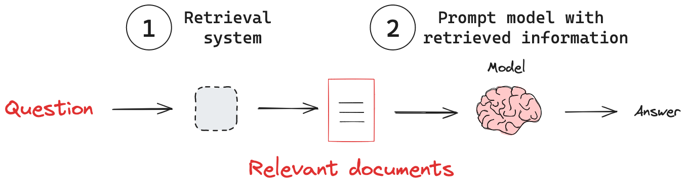
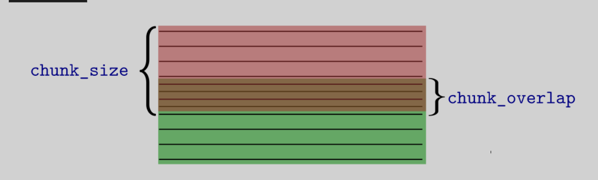
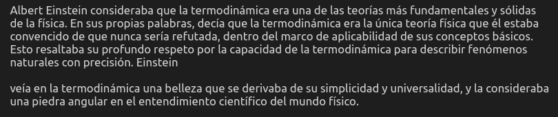
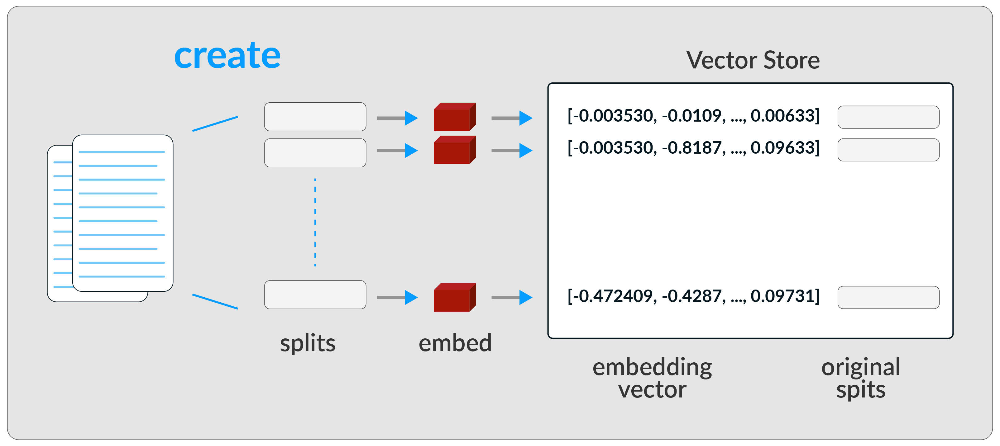
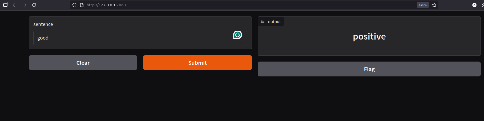
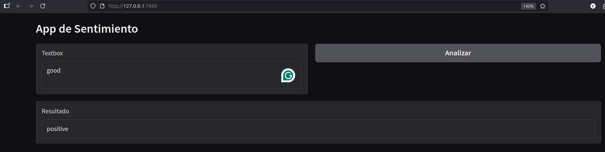

# Módulo 4: Proyecto Integrador: construcción y depliegue de un sisitema RAG


## Introducción al módulo

Bienvenidos al última módulo de nuestro curso sobre aplicaciones asistidas por LLM. En este módulo aprenderemos sobre document loaders y desplegaremos una aplicación RAG funcional para conversar con archivos en PDF. ¡Comencemos!

## Retival Aumented generation (RAG)

El desempeño de un modelo de lenguaje en un tópico particular depende de cuánto haya visto datos sobre este tópico en su proceso de entrenamiento. Si un tema no aparece mucho en internet, el modelo tiene una capacidad limitada para responder preguntas sobre este, mientras que si este tema es muy bien difundido, el desempeño del modelo en este tipo de temas será mucho mejor. Por otro lado, existe información que el modelo nunca vio, por ejemplo, los contratos de compraventa de una empresa que se dedica a la venta de casas, los decretos y ordenanzas que los gobiernos emitieron después de la última actualización del modelo, etc.

En una RAG, un LLM recupera documentos contextuales a partir de una base de datos externa como parte de su ejecución. Esto es útil si queremos hacer preguntas sobre documentos específicos. La figura muestra el esquema general de una aplicación RAG.
{ width=" " }
*Esquema de flujo de una aplicación RAG. Fuente: [LangChain Documentation](https://python.langchain.com/docs/concepts/rag/).*

El sistema de Recuperación (Retrieval) es el encargado de devolver los documentos relevantes para que el LMM (Modelo de Lenguaje de Máquina) elabore la respuesta a partir de una solicitud. Este sistema está compuesto por tres subsistemas:

- **Cargador de Documentos (Document Loader):** carga documentos desde diversas fuentes, como archivos locales, sitios web, bases de datos, etc.
- **Divisor de Texto (Text Splitter):** divide los documentos en fragmentos manejables para su procesamiento.
- **Almacén Vectorial (Vector Store):** almacena representaciones vectoriales de los documentos para una recuperación eficiente.

La Figura ilustra cómo estos subsistemas interactúan en el pipeline de RAG:

{ #fig-retrieval-subsystems }
*Fuente: [Curso "Chat with Your Data" de DeepLearning.AI](https://www.deeplearning.ai/short-courses/chat-with-your-data/).*<!-- Nota para edición: Por favor construit ua imagen propia-->
## Cargadores de Documentos

Comenzaremos experimentando con algunas de las herramientas de carga de documentos disponibles. Es importante resaltar que existe una gran variedad, como lo ilustra la imagen:


*Fuente: [Curso "Chat with Your Data" de DeepLearning.AI](https://www.deeplearning.ai/short-courses/chat-with-your-data/).*

En esencia, un Cargador de Documentos en LangChain es un componente que obtiene datos de una fuente especificada y los transforma en un formato estandarizado que LangChain puede entender y con el que puede trabajar. Este formato estandarizado es típicamente un objeto Documento.

Una vez que un cargador de documentos ingiere datos, usualmente los transforma en uno o más objetos Documento. Piensa en esto como nuestro contenedor estandarizado para datos de texto. Un objeto Documento en LangChain consiste principalmente en dos atributos clave:

- **page_content:** contiene el contenido de texto real del documento o un fragmento de él.

- **metadata (diccionario):** es un diccionario que contiene información adicional sobre el contenido. ¡Esto es muy importante! Los metadatos pueden incluir información como la siguiente:
    - La fuente del documento (por ejemplo, nombre del archivo, URL, ID de base de datos)
    - Fecha de creación, autor
    - Número de página (para PDFs)
    - Títulos de secciones específicas
    - Cualquier otra información contextual que consideres relevante.

El uso efectivo de metadatos puede mejorar significativamente la capacidad de tu aplicación para filtrar, buscar y entender el contexto de la información.

## Categorías y ejemplos de cargadores de documentos

LangChain ofrece un vasto ecosistema de cargadores de documentos, ¡actualmente más de 80! y sigue añadiendo más. Exploremos algunos:

### Cargadores Basados en Archivos:
Estos cargadores leen datos directamente de archivos. Vemos algunos:

#### Documentos PDF

##### `PyPDFLoader` 

Una de las herramientas diponibles para carga de documentos en PDF es  `PyPDFLoader`. Este cargador extrae texto y metadatos de archivos PDF basados en texto, es decir, no es apropiado si el PDF es un escaneo de una imagen. Supongamos que nuestro texto lo tenemos en la carpeta de contenidos `./content`. En este caso, cargaremos el archivo [attention.pdf](../assets/documents/attention.pdf) de la siguiente manera:

```python
from langchain.document_loaders import PyPDFLoader

output_path = "./content/"
file_path = output_path + 'attention.pdf'
loader = PyPDFLoader(file_path)  # Instancia del cargador.
pages = loader.load()
```
La línea `pages = loader.load()` ejecuta el método `.load()`, que lee el PDF y devuelve una lista de objetos `Document`. Cada `Document` representa una página del PDF, con `page_content` (el texto extraído) y `metadata` (información como la fuente y el número de página).

`pages` será una lista de objetos `Document`.  
Cada `Document` tendrá:
- `page_content`: El texto extraído de una página del PDF.
- `metadata`: Un diccionario con información como `{"source": "./content/attention.pdf", "page": n}` (donde `n` es el número de página, comenzando desde 0).

Podemos inspeccionar el contenido cargado:

=== "Código"
    ```python
    pages
    ```
=== "Salida"
    ```bash
    [<Document page_content="Texto de la página 1" metadata={"source": "./content/attention.pdf", "page": 0}>,
    <Document page_content="Texto de la página 2" metadata={"source": "./content/attention.pdf", "page": 1}>,
    ...]
    ```
    
Así, por ejemplo, podremos acceder al contenido cargado de la primera página haciendo:

=== "Código"
    ```python
    first_page = pages[0]
    print("Contenido de la primera página:")
    print(first_page.page_content)
    ```

=== "Salida"
    ```bash
    Contenido de la primera página:
    Provided proper attribution is provided, Google hereby grants permission to
    reproduce the tables and figures in this paper solely for use in journalistic or
    scholarly works.
    Attention Is All You Need
    Ashish Vaswani∗
    Google Brain
    avaswani@google.com
    Noam Shazeer∗
    Google Brain
    noam@google.com
    Niki Parmar∗
    Google Research
    nikip@google.com
    Jakob Uszkoreit∗
    Google Research
    usz@google.com
    Llion Jones∗
    Google Research
    llion@google.com
    Aidan N. Gomez∗ †
    University of Toronto
    aidan@cs.toronto.edu
    Łukasz Kaiser∗
    Google Brain
    ...
    †Work performed while at Google Brain.
    ‡Work performed while at Google Research.
    31st Conference on Neural Information Processing Systems (NIPS 2017), Long Beach, CA, USA.
    arXiv:1706.03762v7  [cs.CL]  2 Aug 2023
    ```
!!! tip "📖 Para aprender más"
    Puedes conocer más cargadores de documentos PDF consultando la documentación de LangChain en:
    [How to: load PDF files.](https://python.langchain.com/docs/integrations/document_loaders/#pdfs)

##### Unstructured

El cargador de documentos Unstructured se utiliza para cargar archivos de muchos tipos. Actualmente, Unstructured admite la carga de archivos de texto, presentaciones de PowerPoint, HTML, PDFs, imágenes y más.

El paquete Unstructured de Unstructured.IO extrae texto limpio de documentos fuente como PDFs y documentos de Word.

!!! warning "Para tener en cuenta"
    La API de Unstructured requiere claves de API para realizar solicitudes para opciones más avanzadas. Puedes solicitar una clave de API [aquí](https://unstructured.io/enterprise) y comenzar a usarla.

Para ilustrar su uso, usaremos el mismo archivo PDF del ejemplo anterior:

```python
from unstructured.partition.pdf import partition_pdf

output_path = ".content/"
file_path = output_path + 'attention.pdf'
```

En su forma más básica, sin ninguna configuración adicional, podemos cargar el documento como:

```python
# Carga y procesa el pdf con la configuración básica
chunks = partition_pdf(filename=file_path)
```

=== "Salida"
    ```bash
    [<unstructured.documents.elements.Text at 0x702efe8e0a60>,
    <unstructured.documents.elements.NarrativeText at 0x702efe8e0ac0>,
    ...
    ```

Visualicemos los documentos extraídos:

```python
# Muestra los elementos extraídos
for chunk in chunks:
    print(chunk)
```

=== "Salida"
    ```bash
    3 2 0 2
    g u A 2
    ] L C . s c [
    ...
    ```

!!! tip "📖 Para aprender más"
    Puedes explorar las diferentes funcionalidades de carga en el siguiente enlace:
    [Documentación de Unstructured](https://docs.unstructured.io/open-source/core-functionality/chunking)

Para un mayor control sobre la forma en que podemos extraer los diferentes tipos de datos del PDF, podemos configurar la función `partition_pdf` de la siguiente manera:

```python
chunks = partition_pdf(
    filename=file_path,
    infer_table_structure=True,            # Extraer tablas
    strategy="hi_res",                     # Necesario para inferir tablas

    extract_image_block_types=["Image"],   # Agregar 'Table' para extraer imágenes de tablas
    # image_output_dir_path=output_path,   # Si es None, las imágenes y tablas se guardarán en base64 en memoria

    extract_image_block_to_payload=True,   # Si es True, extraerá base64 para uso en API

    chunking_strategy="by_title",          # O 'basic'
    max_characters=10000,                  # Por defecto es 500
    combine_text_under_n_chars=2000,       # Por defecto es 0
    new_after_n_chars=6000,

    # extract_images_in_pdf=True,          # Obsoleto
)
```
Aquí, la función `partition_pdf` procesa el archivo PDF extrayendo no solo texto, sino también imágenes y tablas. La función divide el PDF en partes manejables, conocidas como "chunks", y permite ajustar la forma en que se extraen los diferentes tipos de contenido. En particular, se infiere la estructura de las tablas, se extraen bloques de imágenes, y se define cómo dividir el contenido en chunks basándose en títulos y límites de caracteres. Las imágenes extraídas se codifican en base64 para facilitar su transmisión o almacenamiento.

!!! tip "📖 Para aprender más"
    El formato base64 es un método de codificación que convierte datos binarios en texto ASCII, permitiendo que los datos sean fácilmente transmitidos a través de medios que solo soportan texto. Puedes aprender más sobre el formato base64 en la [documentación de Wikipedia](https://es.wikipedia.org/wiki/Base64).
Verifiquemos el contenido extraído:

```python
chunks
```

=== "Salida"
    ```bash
    [<unstructured.documents.elements.CompositeElement at 0x702efeb07670>,
     <unstructured.documents.elements.CompositeElement at 0x702e358f2be0>,
     <unstructured.documents.elements.CompositeElement at 0x702efeb07be0>,
     <unstructured.documents.elements.CompositeElement at 0x702efeb07f40>,
     ...
    ```

Con esta configuración, obtenemos dos tipos de elementos:

```python
set([str(type(el)) for el in chunks])
```

=== "Salida"
    ```bash
    {"<class 'unstructured.documents.elements.CompositeElement'>",
     "<class 'unstructured.documents.elements.Table'>"}
    ```

Un `CompositeElement` generalmente contiene múltiples elementos secundarios de varios tipos, como texto, imágenes o tablas. Esto permite que la biblioteca gestione secciones de un documento compuestas por diferentes tipos de contenido como una sola entidad.

En el procesamiento de documentos, es común encontrar secciones que incluyen una mezcla de texto, imágenes y otros elementos que lógicamente son parecidos. 
Un `CompositeElement` puede representar dichas secciones. Cada objeto `CompositeElement` tiene un atributo `metadata`, que es una instancia de la clase `ElementMetadata`. Este atributo contiene información adicional sobre el chunk, como números de página, detalles del archivo o datos estructurales. Por ejemplo:

```python
chunks[3].metadata.orig_elements
```

=== "Salida"
    ```bash
    [<unstructured.documents.elements.Title at 0x702e35e7ed60>,
     <unstructured.documents.elements.NarrativeText at 0x702e35e7edf0>,
     <unstructured.documents.elements.Footer at 0x702e0cedd940>,
     <unstructured.documents.elements.Image at 0x702e0ceddd00>,
     <unstructured.documents.elements.Image at 0x702e0ceddac0>,
     <unstructured.documents.elements.NarrativeText at 0x702e0cedde50>,
     <unstructured.documents.elements.NarrativeText at 0x702e0d38a730>,
     <unstructured.documents.elements.Title at 0x702e0d38aca0>,
     <unstructured.documents.elements.NarrativeText at 0x702e0d38adc0>,
     <unstructured.documents.elements.NarrativeText at 0x702e0d16a7c0>,
     <unstructured.documents.elements.Formula at 0x702e0d16a0a0>,
     <unstructured.documents.elements.NarrativeText at 0x702e0d16a610>,
     <unstructured.documents.elements.NarrativeText at 0x702e0d433d30>]
    ```

Aquí, `orig_elements` es un campo específico dentro de la metadata que almacena una referencia a los elementos originales, no divididos, a partir de los cuales se creó el chunk. Generalmente, es una lista de objetos `Element` que fueron combinados o procesados para formar el chunk actual. En este chunk particular, tenemos los siguientes elementos:

- Título
- Texto narrativo
- Pie de página
- Imagen
- Fórmula

Separemos las imágenes en el chunk:

```python
elements = chunks[3].metadata.orig_elements

chunks_images = [el for el in elements if "Image" in str(type(el))]
chunks_images
```

=== "Salida"
```bash
[<unstructured.documents.elements.Image at 0x702e0ceddd00>,
 <unstructured.documents.elements.Image at 0x702e0ceddac0>]
```

La siguiente función extraerá todas las imágenes del documento en una lista:


```python
# Extraer las imágenes de los CompositeElements

def get_images_base64(chunks):
    images_b64 = []
    for chunk in chunks:
        if "CompositeElement" in str(type(chunk)):  # Filtramos los CompositeElements
            chunks_els = chunk.metadata.orig_elements
            for el in chunks_els:
                if "Image" in str(type(el)):
                    images_b64.append(el.metadata.image_base64)
    return images_b64
```
Y podemos verificar la extracción visualizándola:

```python
import base64
from IPython.display import Image, display

def display_base64_image(base64_code):
    image_data = base64.b64decode(base64_code)
    display(Image(data=image_data))

images = get_images_base64(chunks)
display_base64_image(images[0])
```

=== "Salida"
    


### Web Based

Veamos ahora un ejemplo corto de carga de un documento web:

```python
from langchain.document_loaders import WebBaseLoader

loader = WebBaseLoader("https://concepto.de/reino-fungi/")
docs = loader.load()
print(docs[0].page_content[:500])
```

=== "Salida"
```bash
Reino Fungi - Concepto, tipos, características y ejemplos

...

Arte
Conocimiento
C
```

Este tipo de cargadores dejan como espacios en blanco los objetos que no son texto, como imágenes o tablas. Por lo tanto, requeriremos conectar otras herramientas que nos permitan hacer un pos-procesamiento adecuado.
Una característica de `WebBaseLoader` es que permite cargar varias URLs a la vez. Vamos a cargar contenido de dos páginas relacionadas:

```python
# Lista de URLs a cargar
urls = [
    "https://es.wikipedia.org/wiki/Inteligencia_artificial",
    "https://es.wikipedia.org/wiki/Aprendizaje_autom%C3%A1tico"
]

# Cargamos múltiples páginas
multi_loader = WebBaseLoader(urls)
multi_documents = multi_loader.load()

# Mostramos el número de documentos cargados y un extracto de cada uno
print(f"Se cargaron {len(multi_documents)} documentos.")
for i, doc in enumerate(multi_documents):
    print(f"Documento {i + 1} (primeros 200 caracteres):")
    print(doc.page_content[:200])
```

=== "Salida"
```bash
Se cargaron 2 documentos.
Documento 1 (primeros 200 caracteres):

Inteligencia artificial - Wikipedia, la enciclopedia libre

...

El algoritmo aprende observando el mundo que le rodea. Su información de entrada es la retroalimentación que obtiene del mundo exterior como respuesta a sus acciones. Por lo tanto, el sistema aprende a base de ensayo-error.

El aprendizaje por refuerzo es el más general entre las tres categorías. En vez de que un instructor indique al agente qué hacer, el agente inteligente debe aprender cómo se comporta el entorno mediante recompensas (refuerzos) o castigos, derivados del éxito o del fracaso respectivamente. El objetivo principal es aprender la función de valor que le ayude al agente inteligente a maximizar la señal de recompensa y así optimizar sus políticas de modo a comprender el comportamiento del entorno y a tomar buenas decisiones para el logro de sus objetivos formales.

Los principales algoritmos de aprendizaje por refuerzo se desarrollan dentro de los métodos de resolución de problemas de decisión finitos de Markov, que incorporan las ecuaciones de Bellman y las funciones de valor. Los tres métodos principales son: la programación dinámica, los métodos de Monte Carlo y el aprendizaje de diferencias temporales.

Entre las implementaciones desarrolladas está AlphaGo, un programa de IA desarrollado por Google DeepMind para jugar el juego de mesa Go. En marzo de 2016 AlphaGo le ganó una partida al jugador profesional Lee Se-Dol que tiene la categoría noveno dan y 18 títulos mundiales. Entre los algoritmos que utiliza se encuentra el árbol de búsqueda Monte Carlo, también utiliza aprendizaje profundo con redes neuronales. Puede ver lo ocurrido en el documental de Netflix “Alp
```
#### YouTube

La API `YouTubeTranscriptApi` es una herramienta útil para extraer transcripciones de videos de YouTube. Esta API permite obtener los subtítulos de un video en diferentes idiomas, facilitando el análisis de contenido de video de manera programática. A continuación, ilustraremos su uso utilizando el video de YouTube sobre  [retropropagación ](https://www.youtube.com/watch?v=kbGu60QBx2o).

```python
from youtube_transcript_api import YouTubeTranscriptApi

# Extraemos el ID del video desde la URL
video_id = "kbGu60QBx2o"  # ID de https://www.youtube.com/watch?v=kbGu60QBx2o (Backpropagation: Data Science Concepts)

try:
    transcript = YouTubeTranscriptApi.get_transcript(video_id, languages=['es', 'en'])
    print("Primeros 500 caracteres del transcrito manual:")
    print(" ".join([entry['text'] for entry in transcript])[:500])
except Exception as e:
    print(f"Error al obtener el transcrito manualmente: {str(e)}")
```

=== "Salida"
```bash
[Music] hey everyone in this video we're going to do a followup to our initial video on neural networks and this video is going to be on back propagation now I'm making this video on back propagation mostly because it's a really difficult concept to understand at least it was for me I read through multiple blog posts and watch videos and everyone seems to have their own kind of way of understanding and explaining it and it was difficult for me to match up all those understandings into what this 
```
## Text Splitters

Una vez hemos cargado el o los documentos sobre los cuales queremos realizar RAG , debemos separarlos en fragmentos sobre los cuales crearemos nuestra base de datos de embeddings, es decir, una base de datos vectorial (ver [Figura 2](#fig-retrieval-subsystems)). La herramienta que nos permite hacer esto son los llamados **Text Splitters**.
LangChain ofrece varias implementaciones de **Text Splitters** para dividir texto basándose en:

- **Caracteres**  
- **Tokens**  
- **Líneas**  
- **Oraciones**  

Por ejemplo, el **CharacterTextSplitter** divide el texto en función de caracteres, mientras que el **RecursiveCharacterTextSplitter** intenta dividir por varios delimitadores (como `\n` o espacios) hasta encontrar el tamaño adecuado.

En general, el texto completo será dividido según un parámetro que limita el tamaño del fragmento (`chunk_size`) y otro parámetro que le indica al text splitter el nivel de superposición de textos en dos fragmentos contiguos (`chunk_overlap`). El solapamiento es deseable para garantizar que las ideas que no estén completas en un fragmento queden completas en el siguiente, como lo ilustra la figura:



Para usar el `RecursiveCharacterTextSplitter` y el `CharacterTextSplitter`, cargaremos el módulo:

```python
from langchain.text_splitter import RecursiveCharacterTextSplitter, CharacterTextSplitter
```

### RecursiveCharacterTextSplitter

Dividamos un texto usando un tamaño de fragmento de 26 caracteres y un solapamiento de 4 caracteres.

```python
chunk_size = 26
chunk_overlap = 4

# Instanciamos los dos splitters
r_splitter = RecursiveCharacterTextSplitter(
    chunk_size=chunk_size,
    chunk_overlap=chunk_overlap
)

c_splitter = CharacterTextSplitter(
    chunk_size=chunk_size,
    chunk_overlap=chunk_overlap
)
```
Usemos el divisor en la cadena de texto:

```python
text1 = 'abcdefghijklmnopqrstuvwxyz'
r_splitter.split_text(text1)
```

=== "Salida"
    ```bash
    ['abcdefghijklmnopqrstuvwxyz']
    ```

Como el texto es demasiado corto, el splitter solo genera un fragmento. Un texto un poco más largo, como en:

```python
text2 = 'abcdefghijklmnopqrstuvwxyznopqrstuvwxyz'
r_splitter.split_text(text2)
```

Dividirá el texto en dos fragmentos.

=== "Salida"
    ```bash
    ['abcdefghijklmnopqrstuvwxyz', 'wxyznopqrstuvwxyz']
    ```
Ahora hagámoslo con el splitter de caracteres:

```python
c_splitter.split_text(text3)
```

Lo que vemos es que no trata de dividirlo. ¿Qué está pasando? Debemos escoger el carácter separador. Por ejemplo, `separator = ' '`.

```python
c_splitter = CharacterTextSplitter(
    chunk_size=chunk_size,
    chunk_overlap=chunk_overlap,
    separator=' '
)
c_splitter.split_text(text3)
```

=== "Salida"
    ```bash
    ['a b c d e f g h i j k l m', 'l m n o p q r s t u v w x', 'w x y z']
    ```

Vemos otro ejemplo:
```python
# Reemplaza la variable some_text por otro texto del mismo tamaño sobre lo que opinaba Einstein sobre termodinámica
some_text = """Albert Einstein consideraba que la termodinámica era 
una de las teorías más fundamentales y sólidas de la física. En sus
 propias palabras, decía que la termodinámica era la única teoría 
 física que él estaba convencido de que nunca sería refutada, dentro 
 del marco de aplicabilidad de sus conceptos básicos. Esto resaltaba 
 su profundo respeto por la capacidad de la termodinámica para describir 
 fenómenos naturales con precisión. Einstein veía en la termodinámica una
  belleza que se derivaba de su simplicidad y universalidad, y la consideraba
   una piedra angular en el entendimiento científico del mundo físico."""

len(some_text)
```

=== "Salida"
```bash
625
```

```python
c_splitter = CharacterTextSplitter(
    chunk_size=450,
    chunk_overlap=0,
    separator=' '
)
r_splitter = RecursiveCharacterTextSplitter(
    chunk_size=450,
    chunk_overlap=0,
    separators=["\n\n", "\n", " ", ""]
)
```

Cuando especificamos `separators=["\n\n", "\n", " ", ""]`, significa que el splitter usa estos separadores en ese orden hasta que encuentra un tipo de separador que le sirva.

```python
c_splitter.split_text(some_text)
from IPython.display import Markdown, display
print(c_splitter.split_text(some_text))
display(Markdown(c_splitter.split_text(some_text)[0]))
display(Markdown(c_splitter.split_text(some_text)[1]))
```

=== "Salida"

<div class="grid cards" markdown>

- :fontawesome-solid-gears:{ .lg .middle } **Reto formativo**  
  **Planteamiento**:
  Utiliza PyPDFLoader para cargar el documento [attention.pdf](../assets/documents/attention.pdf) u otro de tu preferencia.
  * Usa `CharacterTextSplitter` y experimenta con diferentes parámetros, por ejemplo: 
    ```python
    separator="\n",
    chunk_size=1000,
    chunk_overlap=150,
    length_function=len
    ```
  * Visualiza el número de documentos cargados.
  * ¿Cuántas páginas tiene el documento?
  
</div>
## Almacenamiento en la base de datos vectorial

El paso siguiente en la construcción de nuestro RAG (ver figura 2) consiste en crear representaciones vectoriales de los fragmentos. Las representaciones vectoriales de texto, o *embeddings*, son creadas a partir de modelos de lenguaje (LLM). Un *embedding* se genera utilizando un LLM que convierte texto en vectores numéricos, capturando el contexto y el significado semántico del texto. El flujo es mostrado en la figura:



!!! Tip "Para aprender más"
    Las bases de datos vectoriales son sistemas especializados en el almacenamiento, indexación y recuperación eficiente de vectores de alta dimensión. Estos vectores, que comúnmente representan características numéricas extraídas de datos como texto, imágenes, audio o video, permiten realizar búsquedas basadas en similitud (por ejemplo, utilizando distancia euclidiana, coseno o HNSW). A diferencia de las bases de datos tradicionales orientadas a registros, las bases de datos vectoriales están optimizadas para operaciones de búsqueda aproximada de vecinos más cercanos (Approximate Nearest Neighbor Search, ANNS), lo que las hace ideales para tareas de recuperación semántica, sistemas de recomendación, reconocimiento de patrones y aplicaciones en inteligencia artificial.

    Estos sistemas son clave en entornos de aprendizaje automático y procesamiento de lenguaje natural (PLN), donde se requiere comparar representaciones vectoriales de datos embebidos (embeddings). Algunas implementaciones populares incluyen FAISS (Facebook AI Similarity Search), Annoy (Spotify), Milvus y Weaviate, que ofrecen distintos enfoques y estructuras para manejar escalabilidad, latencia y precisión.

    Para profundizar en el tema, se recomienda la siguiente referencia técnica:  
    **Johnson, J., Douze, M., & Jégou, H. (2019). [Billion-scale similarity search with GPUs](https://arxiv.org/abs/1702.08734)**. *arXiv preprint arXiv:1702.08734*.
### Embeddings

Los embeddings son las representaciones vectoriales de los fragmentos de texto entregados por el `TextSplitter`. Textos similares tienen representaciones similares en el espacio de embeddings, lo que significa que podemos comparar estos vectores y encontrar fragmentos de texto que son similares o relevantes dada una consulta. Crearemos nuestros embeddings usando `OpenAIEmbeddings`.

Veamos su funcionamiento con un ejemplo sencillo:
```python
from dotenv import load_dotenv
import os
from langchain_openai import OpenAIEmbeddings
import numpy as np
from sklearn.metrics.pairwise import cosine_similarity

# Cargar variables de entorno (por ejemplo, OPENAI_API_KEY)
load_dotenv()

# Definir oraciones menos creativas con temas de comida/cocina y clima
sentence1 = "I like pasta."
sentence2 = "I like noodles."
sentence3 = "The soup I made is bad."
sentence4 = "The sky is blue."

# Lista de todas las oraciones
sentences = [sentence1, sentence2, sentence3, sentence4]

# Inicializar embeddings de OpenAI
embeddings_model = OpenAIEmbeddings() 

# Generar embeddings para todas las oraciones
embeddings = embeddings_model.embed_documents(sentences)

# Convertir embeddings a un array de numpy para el cálculo de similitud
embeddings_array = np.array(embeddings)

# Calcular la similitud coseno entre todos los pares de oraciones
similarity_matrix = cosine_similarity(embeddings_array)

# Imprimir puntuaciones de similitud
print("Cosine Similarity Matrix:")
print("Sentences:")
for i, sentence in enumerate(sentences):
    print(f"{i+1}. {sentence}")
print("\nSimilarity Scores:")
for i in range(len(sentences)):
    for j in range(i + 1, len(sentences)):
        print(f"Similarity between '{sentences[i][:50]}...' and '{sentences[j][:50]}...': {similarity_matrix[i][j]:.4f}")
```

=== "Salida"
```bash
Cosine Similarity Matrix:
Sentences:
1. I like pasta.
2. I like noodles.
3. The soup I made is bad.
4. The sky is blue.

Similarity Scores:
Similarity between 'I like pasta....' and 'I like noodles....': 0.9300
Similarity between 'I like pasta....' and 'The soup I made is bad....': 0.6500
Similarity between 'I like pasta....' and 'The sky is blue....': 0.6100
Similarity between 'I like noodles....' and 'The soup I made is bad....': 0.6400
Similarity between 'I like noodles....' and 'The sky is blue....': 0.6000
Similarity between 'The soup I made is bad....' and 'The sky is blue....': 0.6700
```
Con mayor similitud entre la oración 3 y la oración 4 debido a que ambas están relacionadas con el clima, e incluso una similitud mayor entre las oraciones 1 y 2 ya que están relacionadas con comidas italianas.

El modelo `text-embedding-ada-002` es un Transformer optimizado para tareas de embeddings, entrenado en grandes cantidades de datos de texto para capturar relaciones semánticas.

!!! warning "Para tener en cuenta"
    El modelo `text-embedding-ada-002` de OpenAI es un Transformer optimizado para tareas de embeddings, entrenado en grandes cantidades de datos de texto para capturar relaciones semánticas. El texto de entrada (por ejemplo, "I like pasta.") se tokeniza, dividiendo las palabras o subpalabras en unidades (tokens) que el modelo entiende.

    Cada token se convierte en un vector inicial (word embedding) basado en un vocabulario aprendido durante el entrenamiento.

    Un Transformer procesa los tokens a través de múltiples capas de redes neuronales.

    Las capas de atención capturan la importancia de cada token en relación con los demás, es decir, el contexto. Por ejemplo, en "I like pasta.", "pasta" se interpreta en el contexto de "like", lo que da un significado positivo.

    Esto produce representaciones contextuales que reflejan no solo las palabras individuales, sino también su relación en la frase. Las capas finales del modelo combinan las representaciones contextuales en un solo vector fijo (por ejemplo, 1536 dimensiones para `text-embedding-ada-002`).

    Este vector es una representación densa del significado semántico del texto, donde textos con significados similares (por ejemplo, "I like pasta." y "I like noodles.") tienen vectores cercanos en el espacio.

Hemos usado el producto escalar para compararlos, ya que este es proporcional a la distancia entre los vectores. Recordemos que dados dos vectores $\mathbf{A}$ y $\mathbf{B}$, el producto escalar está definido como $\mathbf{A} \cdot \mathbf{B} = AB \cos(\theta)$, como $\cos(0) = 1$ entonces los vectores son más cercanos entre más próximo esté este número de 1.
### Creando la Vectorstore

Existen diversas opciones de almacenamiento vectorial, cada una con características específicas. Algunas de las opciones más populares incluyen:

- **Pinecone**: Ofrece un servicio escalable y rápido para almacenar y buscar vectores, ideal para aplicaciones en la nube.
- **Faiss**: Un framework de Facebook AI Research que es eficiente para búsquedas de similitud y clustering, especialmente útil para grandes cantidades de datos.
- **Annoy**: Desarrollado por Spotify, es adecuado para búsquedas aproximadas en grandes datasets, optimizando el uso de memoria.
- **Chroma**: Es una opción versátil que puede funcionar tanto localmente como en la nube, facilitando la integración con aplicaciones que requieren búsquedas rápidas y eficientes.

En este ejemplo, utilizaremos **Chroma** debido a su flexibilidad y facilidad de uso cuando se implementa localmente. Chroma permite almacenar los embeddings generados y realizar búsquedas de similitud de manera eficiente, lo cual es ideal para aplicaciones que requieren procesamiento rápido sin depender de servicios externos.

Volvemos al ejemplo del PDF (`attention.pdf`). Lo cargaremos con `PyPDFLoader` y lo dividiremos en fragmentos usando `RecursiveCharacterTextSplitter`.

```python
from langchain.document_loaders import PyPDFLoader
from langchain.text_splitter import RecursiveCharacterTextSplitter

# Cargamos el PDF
output_path = ".content/"
file_path = output_path + "attention.pdf"
loader = PyPDFLoader(file_path)
documents = loader.load()

# Dividimos en fragmentos
text_splitter = RecursiveCharacterTextSplitter(
    chunk_size=500,  # Tamaño de cada fragmento
    chunk_overlap=50  # Solapamiento entre fragmentos
)
split_docs = text_splitter.split_documents(documents)

# Verificamos cuántos fragmentos tenemos
print(f"Se generaron {len(split_docs)} fragmentos del PDF.")
```

```bash
Se generaron 93 fragmentos del PDF.
```

A continuación, crearemos los embeddings.

```python
from langchain_openai import OpenAIEmbeddings

# Configuramos el modelo de embeddings de OpenAI
embedding_model = OpenAIEmbeddings()  # Usa la variable de entorno OPENAI_API_KEY

# Probamos con un fragmento para verificar
sample_chunk = split_docs[0].page_content
sample_embedding = embedding_model.embed_query(sample_chunk)
print(f"Dimensión del embedding: {len(sample_embedding)}")
print(f"Primeros 5 valores: {sample_embedding[:5]}")
```

```bash
Dimensión del embedding: 1536
Primeros 5 valores: [-0.012028052471578121, 0.01199324894696474, 0.017206797376275063, -0.027745263651013374, -0.0014739236794412136]
```
### Creando la base de datos

Guardaremos los fragmentos y sus embeddings generados por OpenAI en una vectorstore de `Chroma`.

```python
from langchain.vectorstores import Chroma

# Creamos la vectorstore con Chroma
vectorstore = Chroma.from_documents(
    documents=split_docs,  # Los fragmentos del PDF
    embedding=embedding_model,  # Embeddings de OpenAI
    persist_directory="./chroma_db_openai"  # Directorio para esta versión
)

# Verificamos cuántos documentos se almacenaron
print(f"Se almacenaron {vectorstore._collection.count()} fragmentos en la vectorstore.")
```

```bash
Se almacenaron 93 fragmentos en la vectorstore.
```

Con la vectorstore lista, podemos buscar fragmentos relevantes para una consulta como "attention mechanism".

```python
# Realizamos una búsqueda semántica
query = "attention mechanism"
results = vectorstore.similarity_search(query, k=3)  # Top 3 fragmentos más similares

# Mostramos los resultados
for i, result in enumerate(results):
    print(f"Resultado {i + 1}:")
    print(result.page_content)
    print(f"Metadatos: {result.metadata}")
    print("-" * 50)
```

```bash
Resultado 1:
tion models in various tasks, allowing modeling of dependencies without regard to their distance in
the input or output sequences [2, 19]. In all but a few cases [27], however, such attention mechanisms
are used in conjunction with a recurrent network.
In this work we propose the Transformer, a model architecture eschewing recurrence and instead
relying entirely on an attention mechanism to draw global dependencies between input and output.
Metadatos: {'page': 1, 'page_label': '2', 'source': '.content/attention.pdf'}
--------------------------------------------------
Resultado 2:
tion models in various tasks, allowing modeling of dependencies without regard to their distance in
the input or output sequences [2, 19]. In all but a few cases [27], however, such attention mechanisms
are used in conjunction with a recurrent network.
In this work we propose the Transformer, a model architecture eschewing recurrence and instead
relying entirely on an attention mechanism to draw global dependencies between input and output.
Metadatos: {'page': 1, 'page_label': '2', 'source': '.content/attention.pdf'}
--------------------------------------------------
Resultado 3:
tion models in various tasks, allowing modeling of dependencies without regard to their distance in
the input or output sequences [2, 19]. In all but a few cases [27], however, such attention mechanisms
are used in conjunction with a recurrent network.
In this work we propose the Transformer, a model architecture eschewing recurrence and instead
relying entirely on an attention mechanism to draw global dependencies between input and output.
Metadatos: {'source': '.content/attention.pdf', 'page_label': '2', 'page': 1}
--------------------------------------------------
```

### Persistencia de la Vectorstore

La base de datos se guarda en `./chroma_db_openai`. Para cargarla en otros scripts, de esta manera no tendremos que pagar por los embeddings cada vez que un script requiera realizar consultas sobre el documento.

```python
# Cargar la vectorstore existente
loaded_vectorstore = Chroma(
    persist_directory="./chroma_db_openai",
    embedding_function=embedding_model
)

# Verificamos que se cargó
print(f"Fragmentos cargados desde disco: {loaded_vectorstore._collection.count()}")
```

```bash
Fragmentos cargados desde disco: 93
```

Veamos:

```python
query = "embeddings"
results = loaded_vectorstore.similarity_search(query, k=3)  # Top 3 fragmentos más similares

# Mostramos los resultados
for i, result in enumerate(results):
    print(f"Resultado {i + 1}:")
    print(result.page_content)
    print(f"Metadatos: {result.metadata}")
    print("-" * 50)
```

```bash
Resultado 1:
Zhou, and Yoshua Bengio. A structured self-attentive sentence embedding. arXiv preprint
arXiv:1703.03130, 2017.
[23] Minh-Thang Luong, Quoc V . Le, Ilya Sutskever, Oriol Vinyals, and Lukasz Kaiser. Multi-task
sequence to sequence learning. arXiv preprint arXiv:1511.06114, 2015.
[24] Minh-Thang Luong, Hieu Pham, and Christopher D Manning. Effective approaches to attention-
based neural machine translation. arXiv preprint arXiv:1508.04025, 2015.
11
Metadatos: {'page': 10, 'page_label': '11', 'source': '.content/attention.pdf'}
--------------------------------------------------
Resultado 2:
2006.
[30] Ofir Press and Lior Wolf. Using the output embedding to improve language models. arXiv
preprint arXiv:1608.05859, 2016.
[31] Rico Sennrich, Barry Haddow, and Alexandra Birch. Neural machine translation of rare words
with subword units. arXiv preprint arXiv:1508.07909, 2015.
[32] Noam Shazeer, Azalia Mirhoseini, Krzysztof Maziarz, Andy Davis, Quoc Le, Geoffrey Hinton,
and Jeff Dean. Outrageously large neural networks: The sparsely-gated mixture-of-experts
Metadatos: {'page': 11, 'page_label': '12', 'source': '.content/attention.pdf'}
--------------------------------------------------
...
```

## RetrievalQA

Combinaremos la vectorstore con un modelo de lenguaje de OpenAI (`gpt-3.5-turbo` por defecto) para responder preguntas. `RetrievalQA` buscará fragmentos relevantes en la vectorstore y los usará como contexto para generar respuestas.

```python
from langchain.chains import RetrievalQA
from langchain.chat_models import ChatOpenAI

# Configuramos el modelo de lenguaje
llm = ChatOpenAI(
    model_name="gpt-3.5-turbo",
    temperature=0  # Respuestas más precisas y menos creativas
)

# Creamos la cadena RetrievalQA
qa_chain = RetrievalQA.from_chain_type(
    llm=llm,
    chain_type="stuff",  # Usa todos los fragmentos relevantes directamente
    retriever=vectorstore.as_retriever(search_kwargs={"k": 3}),  # Top 3 fragmentos más similares
    return_source_documents=True  # Devuelve los fragmentos usados como fuente
)
```
## Preguntas al PDF

Ahora podemos preguntar algo sobre el contenido del PDF:

=== "Código"
    ```python
    query2 = "¿Cómo se usa la atención?"
    result2 = qa_chain({"query": query2})

    # Mostramos la respuesta
    print("Respuesta:")
    print(result2["result"])
    print("Fragmentos utilizados como fuente:")
    for i, doc in enumerate(result2["source_documents"]):
        print(f"Fuente {i + 1}:")
        print(doc.page_content)
        print(f"Metadatos: {doc.metadata}")
        print("-" * 50)
    ```
=== "Salida"
    ```bash
    Respuesta:
    La atención se utiliza en el contexto de modelos de aprendizaje automático, como en el caso de la atención en el mecanismo de atención de un modelo de lenguaje. La atención se aplica para que el modelo pueda enfocarse en partes específicas de la entrada durante el proceso de aprendizaje y toma de decisiones.

    Fragmentos utilizados como fuente:
    Fuente 1:
    but
    its
    application
    should
    be
    just
    -
    this
    is
    what
    we
    are
    missing
    ,
    in
    my
    opinion
    .
    <EOS>
    <pad>
    Figure 5: Many of the attention heads exhibit behaviour that seems related to the structure of the
    sentence. We give two such examples above, from two different heads from the encoder self-attention
    at layer 5 of 6. The heads clearly learned to perform different tasks.
    15
    Metadatos: {'page_label': '15', 'page': 14, 'source': '.content/attention.pdf'}
    --------------------------------------------------
    Fuente 2:
    .
    <EOS>
    <pad>
    <pad>
    <pad>
    <pad>
    <pad>
    <pad>
    Figure 3: An example of the attention mechanism following long-distance dependencies in the
    encoder self-attention in layer 5 of 6. Many of the attention heads attend to a distant dependency of
    the verb ‘making’, completing the phrase ‘making...more difficult’. Attentions here shown only for
    the word ‘making’. Different colors represent different heads. Best viewed in color.
    13
    Metadatos: {'page_label': '13', 'page': 12, 'source': '.content/attention.pdf'}
    --------------------------------------------------
    Fuente 3:
    but
    its
    application
    should
    be
    just
    -
    this
    is
    what
    we
    are
    missing
    ,
    in
    my
    opinion
    .
    <EOS>
    <pad>
    Figure 4: Two attention heads, also in layer 5 of 6, apparently involved in anaphora resolution. Top:
    Full attentions for head 5. Bottom: Isolated attentions from just the word ‘its’ for attention heads 5
    and 6. Note that the attentions are very sharp for this word.
    14
    Metadatos: {'source': '.content/attention.pdf', 'page_label': '14', 'page': 13}
    --------------------------------------------------
    ```

## Desplegando mi RAG con Gradio

Gradio de Hugging Face es una herramienta poderosa para crear interfaces de usuario interactivas para modelos de aprendizaje automático. Para usar Gradio, lo instalaremos usando pip:

```bash
pip install gradio transformers torch
```

Una vez instalado, crearemos nuestra primera aplicación. Generaremos un archivo con el nombre `app1.py` cuyo contenido es el siguiente código:

```python
import gradio as gr

def analyze_sentiment(sentence):
    if "good" in sentence:
        return "positive"
    elif "bad" in sentence:
        return "negative"
    else:
        return "neutral"

app = gr.Interface(fn=analyze_sentiment, inputs="text", outputs="label")

app.launch()
```

A continuación, ejecutamos la aplicación con el siguiente comando:

```bash
python app1.py
```
La salida se presenta en la imagen.


Gradio genera automáticamente un diseño de interfaz predeterminado que incluye:

- **Widget de entrada**: Un cuadro de texto, ya que se especificó `inputs="text"`.
- **Widget de salida**: Una etiqueta, ya que se especificó `outputs="label"`.
- **Botones de control** para la interacción básica del usuario:
  - **Submit**: Llama a la función que proporcionaste (`analyze_sentiment`).
  - **Clear**: Restablece los componentes de entrada y salida.
  - **Flag**: Permite al usuario marcar un ejemplo (para retroalimentación o depuración).

Estos botones son parte de la interfaz de usuario predeterminada de Gradio; no necesitas definirlos manualmente a menos que desees personalizarlos o eliminarlos.

# Usando Blocks

Si deseas eliminar tanto "Clear" como "Flag" y gestionar tus propios botones, cambia a la API de Blocks:

```python
import gradio as gr

def analyze_sentiment(sentence):
   if "good" in sentence:
       return "positive"
   elif "bad" in sentence:
       return "negative"
   else:
       return "neutral"

with gr.Blocks() as demo:
    gr.Markdown("# App de Sentimiento")
    with gr.Row():
        txt = gr.Textbox(lines=2, placeholder="Ingresa texto")
        btn = gr.Button("Analizar")
    out = gr.Textbox(label="Resultado")

    btn.click(analyze_sentiment, inputs=txt, outputs=out)

demo.launch(share=True)
```

Esto te da control total: solo un botón, y tú decides exactamente qué hace.



# Cómo Usar Ollama para Ejecutar Modelos de IA Localmente en Google Colab

## Introducción

Ollama es una herramienta de código abierto que permite ejecutar modelos de lenguaje grandes (LLMs) de manera local en tu máquina, sin depender de servicios en la nube pagos. Sin embargo, muchos usuarios no cuentan con hardware potente (como GPUs) en sus computadoras locales si ese es tu caso te muestro una manera de experimentar ollama en Google Colab. Lo usaremos para  simular un entorno "local" en la nube, permitiendo correr modelos como Llama o Mistral sin costo adicional. 

> **Nota:** Google Colab tiene límites de uso (por ejemplo, sesiones de 12 horas y cuotas de GPU). Asegúrate de cumplir con las políticas de Google.

## Prerrequisitos

- Una cuenta de Google (para acceder a Colab).
- Conocimientos básicos de Python y comandos de terminal.
- Opcional: Cuenta gratuita en Ngrok (para exponer el puerto) o usa Pinggy (sin cuenta requerida).
- Cambia el runtime de Colab a GPU: Ve a Runtime > Change runtime type > T4 GPU (disponible en el tier gratuito).

## Paso 1: Crear un Nuevo Notebook en Google Colab

1. Ve a [colab.research.google.com](https://colab.research.google.com).
2. Crea un nuevo notebook (Archivo > Nuevo notebook).
3. Configura el runtime con GPU como se mencionó arriba.

## Paso 2: Instalar Dependencias Básicas

Ejecuta las siguientes celdas en tu notebook para preparar el entorno. Usaremos `colab-xterm` para un terminal interactivo, aunque hay métodos alternativos sin él.

=== "Código"
    ```python
    # Instalar colab-xterm
    !pip install colab-xterm
    %load_ext colabxterm
    ```

Con estos pasos iniciales, estarás listo para continuar con la configuración de Ollama en Google Colab.


Esto instala una extensión que permite abrir un terminal dentro de Colab.

## Paso 3: Abrir el Terminal y Instalar Ollama

Ejecuta esta celda para abrir un terminal:

```python
%xterm
```

Dentro del terminal que se abre, ejecuta los siguientes comandos uno por uno:

```bash
curl -fsSL https://ollama.com/install.sh | sh
```

Esto descarga e instala Ollama automáticamente.

Luego, inicia el servidor de Ollama en segundo plano:

```bash
ollama serve &
```

## Paso 4: Descargar y Ejecutar un Modelo

Aún en el terminal, descarga un modelo ligero (por ejemplo, Llama 3.2 de 3B parámetros para evitar límites de memoria):

```bash
ollama pull llama3.2
```

Para probarlo directamente en el terminal:

```bash
ollama run llama3.2
```

Escribe un prompt como "Hola, ¿qué es Ollama?" y presiona Enter. Ollama responderá usando el modelo.


¡Felicidades por llegar hasta el final del módulo y del curso! Has aprendido a integrar plantillas de prompt con cadenas y parsers de salida, implementaste cadenas con memoria y, finalmente, has practicado cómo dividir documentos en fragmentos, almacenar embeddings de los fragmentos en una base de datos vectorial y realizar RAG sobre esta base de datos. Te invito a realizar la [actividad de aprendizaje](#evidencia-de-aprendizaje), donde crearás y desplegarás tu aplicación RAG siguiendo los pasos que acabas de estudiar.

## Glosario

- **AIMessageChunk**: Una respuesta parcial de un mensaje de IA. Se utiliza al transmitir respuestas de un modelo de chat.
- **Configurable runnables**: Creación de Runnables configurables.
- **Context window**: El tamaño máximo de entrada que un modelo de chat puede procesar.
- **Document**: Representación de un documento en LangChain.
- **Embedding models**: Modelos que generan embeddings vectoriales para varios tipos de datos.
- **HumanMessage**: Representa un mensaje de un usuario humano.
- **Vector stores**: Almacenes de datos especializados para almacenar y buscar eficientemente embeddings vectoriales.

## Evidencia de Aprendizaje

| **Módulo 3** | **Proyecto Integrador: construcción y despliegue de un sistema RAG** |
|--------------|-------------------------------------------------------------|
| **EA3.**     | Chat con tus datos

¡Felicidades por llegar al final del curso! En tu última entrega, practicarás las siguientes habilidades:

**Instrucciones**
1. **Carga de documentos**: usa PyPDFLoader para cargar 5 documentos en PDF de tu interés.

2. **División de documentos**: Utiliza RecursiveCharacterTextSplitter o CharacterTextSplitter para dividir los documentos en fragmentos.

3. **Embeddings**: emplea OpenAIEmbeddings para crear embeddings para tus fragmentos.

4. **Almacenamiento vectorial**: carga los embeddings en una base de datos vectorial, como Chroma.

5. **Instrucciones**: ilustra el uso de consultas sobre tus datos cargados en la base de datos vectorial, utilizando consultas por similitud y consultas usando el algoritmo MMR.

Desarrolla tu proyecto en un Jupyter Notebook y carga tu solución. No olvides agregar comentarios en celdas de Markdown que expliquen el código y tus razonamientos.

**Opcional**: investiga sobre plataformas de despliegue de tu aplicación, como Streamlit, Hugging Face, Gradio, etc., y despliega tu RAG para que otros usuarios puedan usarla. También, investiga sobre retrievers y escoge la estrategia de retrieval que mejor se adapte a las necesidades de tu app desplegada.

Guarda los documentos con la siguiente nomenclatura:

- **Apellido_Nombre del estudiante.ipynb**  
**Ejemplo:**  
- López_Karla.ipynb

Finalmente, haz clic en el botón **Cargar Tarea**, sube tu archivo y presiona el botón **Enviar** para remitirlo a tu profesor con el fin de que lo evalúe y retroalimente. |

!!! tip "📖 Nota"
    Conoce los criterios de evaluación de esta evidencia de aprendizaje consultando la rúbrica que encontrarás a continuación.

| **Criterios**             | **Ponderación** |                       |                       |                       |                       | **Totales** |
|---------------------------|------------------|-----------------------|-----------------------|-----------------------|-----------------------|------------|
|                           | **70**           | **50**                | **5**                 | **0**                 |                       |            |
| **Calidad de las Soluciones** | Las soluciones a los ejercicios son correctas, demostrando una implementación adecuada de los conceptos y técnicas requeridos. El estudiante muestra un dominio completo de los temas abordados. | Aunque las soluciones no son completamente correctas, se observa un entendimiento y aplicación adecuada de los conceptos y técnicas involucradas. Hay evidencia de esfuerzo y comprensión de los temas. | Las soluciones presentadas son en su mayoría incorrectas. Se percibe un intento de resolver los ejercicios, pero hay una falta de comprensión de los conceptos y técnicas esenciales. | No realiza la entrega |                       | **70**      |
| **Calidad de la entrega** | El notebook es claro y fácil de seguir, incluyendo comentarios detallados sobre el funcionamiento del código en las celdas Markdown, lo que facilita la comprensión de las soluciones propuestas. | El notebook no es particularmente fácil de leer, pero aún así incluye comentarios que explican el funcionamiento del código en las celdas Markdown, mostrando un esfuerzo por aclarar la lógica detrás del código. | El notebook carece de comentarios acerca del funcionamiento del código en las celdas Markdown, lo que dificulta la comprensión de las soluciones implementadas. | No realiza la entrega |                       | **20**      |
| **Tiempo de la entrega**  | La entrega se realiza a tiempo, cumpliendo con el plazo establecido para la presentación de la actividad. | La entrega se realiza con una semana de atraso. Aunque fuera del plazo original, se considera adecuada para evaluar el trabajo presentado. | La entrega se realiza con más de una semana de atraso, lo que indica un retraso significativo en la presentación de la actividad. | No realiza la entrega |                       | **10**      |
|                           |                  |                       |                       |                       | **Ponderación de la actividad** | **100 puntos** |

# Referencias

DeepLearning.AI. (2025). *LangChain: Chat with Your Data* [Curso en línea]. [https://learn.deeplearning.ai/langchain-chat-with-your-data](https://learn.deeplearning.ai/langchain-chat-with-your-data)

LangChain. (2024). Document loaders. *Python LangChain Documentation*. [https://python.langchain.com/docs/integrations/document_loaders/](https://python.langchain.com/docs/integrations/document_loaders/)

# Lecturas y material complementario

Te invitamos a explorar el siguiente material para ampliar tus conocimientos sobre Retrieval-Augmented Generation (RAG) y su implementación con LangChain.

## 📚 Lecturas recomendadas


### **Título:** *LangChain: Chat with Your Data*  
**Autor:** DeepLearning.AI  
**URL:** [https://learn.deeplearning.ai/langchain-chat-with-your-data](https://learn.deeplearning.ai/langchain-chat-with-your-data)  
Este curso gratuito de DeepLearning.AI ofrece una introducción práctica a la creación de aplicaciones RAG utilizando LangChain. Cubre la carga de documentos, la generación de embeddings, la recuperación de información relevante y la integración con modelos de lenguaje.

### **Título:** *Retrieval-Augmented Generation for Knowledge-Intensive NLP Tasks*  
**Autor:** Lewis, P., Perez, E., Piktus, A., Petroni, F., Karpukhin, V., Goyal, N., ... & Kiela, D.  
**URL:** [https://arxiv.org/abs/2005.11401](https://arxiv.org/abs/2005.11401)  
Este artículo seminal introduce el concepto de Retrieval-Augmented Generation (RAG), explicando cómo combina modelos de recuperación de información con generación de texto para mejorar el rendimiento en tareas intensivas en conocimiento.

### **Título:** *LangChain Documentation: Retrieval-Augmented Generation*  
**Autor:** LangChain  
**URL:** [https://python.langchain.com/docs/use_cases/question_answering/](https://python.langchain.com/docs/use_cases/question_answering/)  
La documentación oficial de LangChain ofrece una guía detallada sobre cómo implementar flujos de trabajo RAG, incluyendo ejemplos prácticos de carga de documentos, creación de índices vectoriales y uso de retrievers para aplicaciones de preguntas y respuestas.

## 🎥 Videos recomendados


### **Título:** *Building RAG Applications with LangChain*  
**Autor:** DataCamp  
**URL:** [[https://www.datacamp.com/courses/building-rag-applications-with-langchain](https://www.datacamp.com/courses/retrieval-augmented-generation-rag-with-langchain)]
Este curso en video explora paso a paso cómo construir aplicaciones RAG utilizando LangChain, con ejemplos prácticos de integración de bases de datos vectoriales y modelos de lenguaje.

### **Título:** *What is Retrieval-Augmented Generation (RAG)?*  
**Autor:** IBM Technology  
**URL:** [https://www.youtube.com/watch?v=T-D1OfcDW1M](https://www.youtube.com/watch?v=T-D1OfcDW1M)  
Este video proporciona una explicación concisa de RAG, destacando cómo combina recuperación de información y generación de texto para mejorar las respuestas de modelos de lenguaje.
