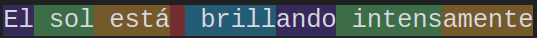

<!--  ESTAS SON ALGUNAS ADAPTACIONES DE LAS ADMONICIONES USADAS EN LAS PLATILLAS DE LA IU. Para usarlas solo debes copiar, pegar y llenar apropiadamente-->

!!! warning "Para tener en cuenta"
    Asegúrate de evaluar los posibles sesgos en los datos antes de implementar un modelo de IA. Los sesgos no detectados pueden llevar a decisiones injustas, afectando la equidad y la confianza en la tecnología.
-

!!! tip "📖 Para aprender más"
    Si deseas conocer más sobre [tema], lee el siguiente material:
    Artículo de [nombre del artículo]:
    URL: [enlace]

<!-- Video -->

- :material-video-vintage:{ .lg .middle } **Video: Oportunidades en IA**  
  **Autor**: Andrew Ng  
  Para obtener una visión sobre el panorama actual de la inteligencia artificial, te invito a que veas la conferencia del profesor Andrew Ng *Oportunidades en IA*.  
  [Ver Video](https://www.youtube.com/watch?v=5p248yoa3oE){ .md-button .md-button--primary }

- :octicons-megaphone-16:{ .lg .middle } **Sabias que**  
  **Autor**: Andrew Ng  
  Para obtener una visión sobre el panorama actual de la inteligencia artificial, te invito a que veas la conferencia del profesor Andrew Ng *Oportunidades en IA*.  
  [Ver Video](https://www.youtube.com/watch?v=5p248yoa3oE){ .md-button .md-button--primary }

- :fontawesome-solid-gears:{ .lg .middle } **Reto formativo**  
  **Plantemiento**:
  Para obtener una visión sobre el panorama actual de la inteligencia artificial, te invito a que veas la conferencia del profesor Andrew Ng *Oportunidades en IA*.  
  [Ver Video](https://www.youtube.com/watch?v=5p248yoa3oE){ .md-button .md-button--primary }

- :simple-taketwointeractivesoftware:{ .lg .middle } **Recurso formativo**  
  **Plantemiento**:
  Para obtener una visión sobre el panorama actual de la inteligencia artificial, te invito a que veas la conferencia del profesor Andrew Ng *Oportunidades en IA*.  
  [Ver Video](https://www.youtube.com/watch?v=5p248yoa3oE){ .md-button .md-button--primary }

<figure>
  
  <figcaption>División en tokens de una frase utilizando el tokenizador de GPT-4. Fuente: <a Elabortación propia </a>.</figcaption>
</figure>

